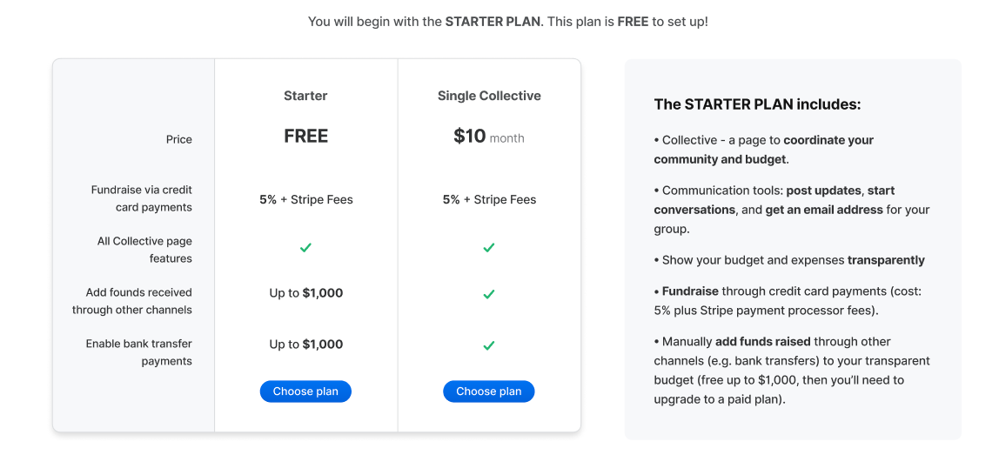

# Pricing

## The short version

**Setting up a Collective is free, but there are fees if you want to accept and pay out money.**

_Read on for more details._

### Single collective and have a bank account.

If you are a **Single Collective and have a bank account** where to receive the money, this will be your plan. If you just want to receive money via Stripe - the fees are 5% + Stripe Fees. You can also choose to manage funds you are receiving elsewhere, for example on a PayPal account, another platform, a t-shirt shop, ticket sales, etc. We call this Add Funds and it's free up to $1000. You can also chose to enable bank transfer payments. This means, enabling your contributors to create a pending donation and receive email instructions with your bank details. You can reconcile the donation when you receive it. This is also free up to $1000. 

### Single collective and don't have access to a bank account for your community.

If you are **Single Collective and don't have access to a bank account**, you need to apply to a Fiscal Host. If you join a Fiscal Host you don't have to pay Open Collective, pricing depends on each host. Check out the [Fiscal Hosts](https://opencollective.com/hosts) on Open Collective.

### An organization and want to create multiple collectives.

If you are an **Organization that wants to become a Fiscal Host** your plan will depend on how many collectives you host as well as your payments options. If you just want to receive money via Stripe - the fees are 5% + Stripe Fees. You can also choose to manage funds you are receiving elsewhere, for example on a PayPal account, another platform, a t-shirt shop, ticket sales, etc. We call this Add Funds and it's free up to $1000. You can also chose to enable bank transfer payments. This means, enabling your contributors to create a pending donation and receive email instructions with your bank details. You can reconcile the donation when you receive them. This is also free up to $1000. When you reach this limit you'll need to go into one of the paid plans according to the number of collectives you host. 

### What is a Fiscal Host?

A fiscal host is a legal company or individual who enables financial transactions, holds funds, and takes care of liability and taxes for a Collective. Fiscal Hosts make it possible for Collectives to transact without incorporating their own legal entity. Each Fiscal Host sets its own fees, most commonly 0% and 5%.

[More info about Fiscal Hosts](../fiscal-hosts/fiscal-hosts.md).

## Examples 

| Collective | Fiscal Host | Cloud SaaS or own servers | Fee\* |
| :--- | :--- | :--- | :--- |
| Open Source Projects \(anywhere\) | Open Source Collective 501\(c\)\(6\) | SaaS | 5% platform fee + 5% fiscal host fee = 10% |
| Charity projects \(US only\) | Open Collective Foundation 501\(c\)\(3\) | SaaS | 5% platform fee + 5% fiscal host fee = 10% |
| Open Collective Paris | Paris-based Collectives | SaaS | 5% platform fee + 0% fiscal host fee = 5% |
| Brussels Together | Brussels-based citizen initiatives | SaaS | 5% platform fee + €10/month fiscal host fee |
| Independent Project | Independent Project, LLC | Own servers | 0% platform fee + 0% fiscal host fee = free |

_\*plus payment processor fees_

### How are Open Collective's fees determined?

The standard fee for fiscal sponsorship, the service provided by Fiscal Hosts, is 10%. This service is commonly offered by foundations and other organizations who manage funds for unincorporated projects. Open Collective offers not only fiscal sponsorship, but also a great software platform for raising money, paying expenses, record keeping, and transparent budgeting. We charge 5% for Fiscal Hosting \(for those Fiscal Hosts that we manage—other hosts set their own fees\) and 5% for the software platform \(if you put money through the system\), so 10% all together. Payment processing fees are determined by the providers we use, [PayPal](https://www.paypal.com/us/webapps/mpp/paypal-fees) and [Stripe](https://stripe.com/pricing).

### What about funds flowing outside the Open Collective platform, like manual bank transfers?

If a Fiscal Host agrees to receive money outside the Open Collective system, for example via bank transfer, it’s possible for them to add the funds manually to your Collective so they show up in your budget. There's no % in this case, but the Fiscal Host needs to have a plan that enables it to do it.

Fiscal Hosts managed by Open Collective charge only the regular platform fee and fiscal host fee for manual transfers, but we only agree to do them for large, infrequent payments or special circumstances, because it’s a time-consuming process.

### Can I put money through the system and still use it for free somehow?

Yes, it’s possible, up to $1000. To do so, you'd need to set up and manage both the Fiscal Hosting side and the software hosting side yourself. So, you’ll need to set up and maintain your own legal entity and your own servers running an instance of the Open Collective open source software. Maintaining a legal entity involves tax and legal liability, admin overhead, and a lot of paperwork, and maintaining servers running your own software involves a lot of technical skill and effort. That’s why many Collectives find that it’s good value to pay Open Collective to provide these services.

