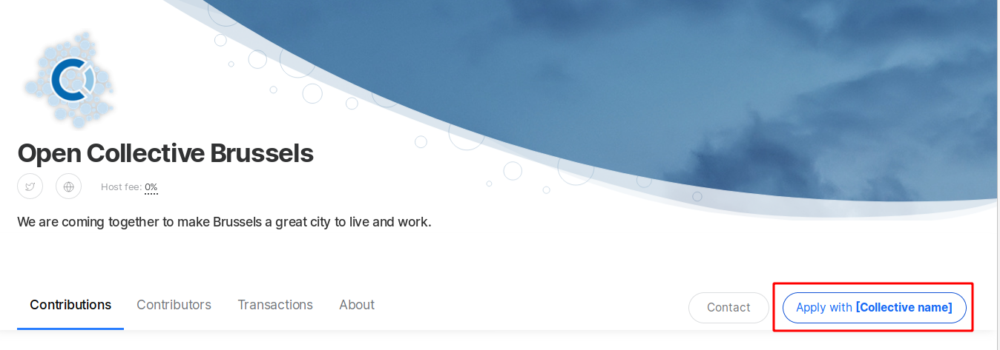
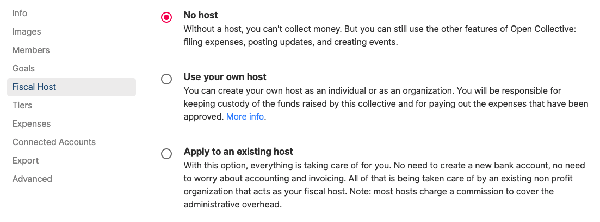

# Add Fiscal Host

## Adding a Fiscal Host

In order to raise and spend money, you'll need a [Fiscal Host](../fiscal-hosts/fiscal-hosts.md). There are different hosts that serve different missions, interest areas, and geographic. [See them all here](https://opencollective.com/hosts).

Click on the apply button on any host page, and if your project fits their criteria, they will approve it.

If you have a legal entity and bank account already, you can also [set up your own fiscal host](../fiscal-hosts/become-a-fiscal-host.md).

If you are an open source project with at least 100 stars on GitHub \(or equivalent other website\), you can apply to create your Collective under the umbrella of the [Open Source Collective](https://opencollective.com/opensource/apply) fiscal host.

To see your Fiscal Host options, go to your Collective Page, click on the gear icon and head to the **Fiscal Host** page.

