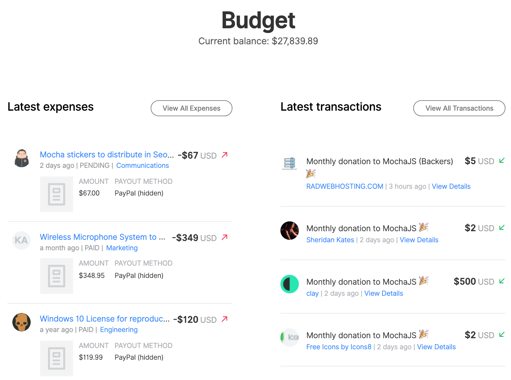
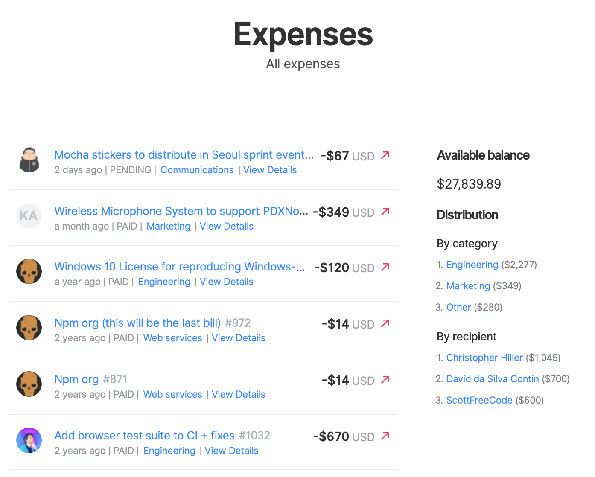
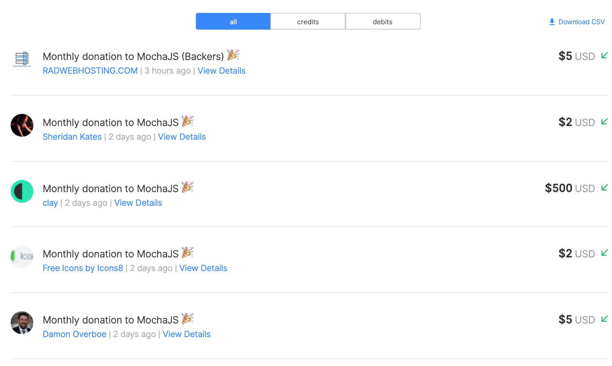

# Transparent Budget

## Inside the platform

Collectives have transparent budgets, where all transactions are automatically reported. Everyone can see where money comes from and what it's spent on.

Private information is hidden. For example, email addresses and attachments \(which may contain personal information\).

The expenses view shows what the Collective has spent money on. You can see individual expenses and the top categories and people the budget has gone toward.

The transactions view shows the budget lines, and you can filter by credits and debits, or export via CSV.

## Migrating your transactions to a spreadsheet

## Step 1

### Download CSV

Download CSV file from /transactions page inside your collective.

## Step 2

### Copy the template

Copy the transactions template into your Google Drive


### [Click here to copy the template](https://docs.google.com/spreadsheets/u/2/d/1vyR75xft45EBhQ2zKJD3JSsn59eaKjrL0soRNt5t724/copy)


## Step 3

### Go to RAW FILE tab

Open the “RAW FILE” tab inside the file.

### Import CSV

**Make sure to check these settings are applied:**

You will see something like this: _\*\*_Now, you will have to do some tweaks to the data before we can use it…

## Step 4

### Change all points for commas

1. Click Cmd+F
2. Select only the numeric values \(From column G to K\)
3. Click on the three dots on the “Find in sheet” instance

   This will open the “Find and replace window”, type a point \(.\) in “Find” and a comma \(,\) in replace with, mark the “Match case” option, then click “Replace all”

### Change format

To change number formatting to US Dollars. Go to menu item “Format” → “Number” → “US Dollar”.

### Sort by oldest to newest

Since the dates of the file run from newest to oldest, it’s better to invert that order, thus being able to add new entries without the need of adding new rows.To do that, first select column “D” \(This is where the date data is listed\)Then go to menu item “Data” → “Sort sheet by column D, A → Z”

## Step 5

### Copy and paste values in the template

Select all values except the With cell A6 selected:Right click → “Paste special” → “Paste values only”  
**Voilà!**You will have your totals for expenses and contributions into a nice and visible balance chart. Plus individual transactions sorted by date and differentiated by color codes.

## Personalization and publishing \(Extra step\)

You can personalize the collective banner by using the function “Insert” → “Image” → “Image in cell”. We are using a PNG of 1920x400. We recommend changing the color of that specific cell to match the collective banner background.

### Publishing

If you go under “File” → “Publish to the web” it will pop out a settings window for this to happen.You decide if you just only publish the URL to access and read\(only\) the file or embed it.

