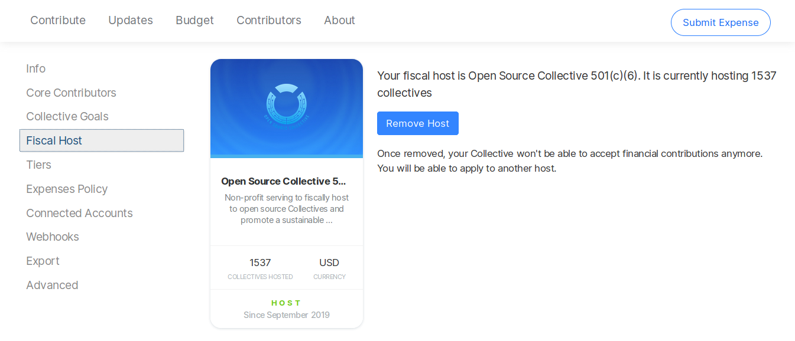

# Change Fiscal Host

You can change the fiscal host of your Collective to a different existing host, or start your own host.

## What does it mean to change fiscal hosts?

Your fiscal host is the house where your Collective "lives" legally and financially. Moving house means your Collective's funds will go to the new host organization's bank account, and the new fiscal host assumes legal responsibility for your project. The new host admin will be the one pressing the "pay" button on your approved expenses.

## What are the benefits of being able to change hosts?

No lock in! If you start out being fiscally hosted by another organization and eventually want to set up your own legal entity, you can move your Collective. This is great for projects that are bootstrapping early on and later build more legal infrastructure.

You can also change between established fiscal host organizations. If you start out under a generalist host, you may later switch when a host specific to your movement or focus area forms. This can happen when a movement scales up, for example. Or you might want to move hosts to change the currency your Collective is in from Dollars to Euros.

## What happens to my recurring financial contributions, followers of updates, and transaction history?

Nothing! Changing hosts will not affect your existing recurring financial contributions or who receives your updates. Your history of transactions will remain intact. Your donors or sponsors are unlikely to notice any changes to your Collective \(except the little "hosted by" text on your page\). Behind the scenes, the money will flow through a different Stripe account to a different bank account.

## What is the process for changing fiscal hosts?


Before starting the process to change Fiscal Hosts, get in touch with your new Fiscal Host to confirm they are ready to approve your request to join them.


**1.** [Zero the balance](zero-collective-balance.md) of your Collective

**2.** Go to your Collective page, click on the gear icon and head to the Fiscal Host page.

**3.** Remove your current Fiscal Host.

**4.** Select **Create a fiscal host** \(if you want to set up your own\), **Apply to an existing host** \(if you'll be hosted by another entity\), or visit the page of the Fiscal Host you wish to join and click on the Apply button.

**5.** Wait for your new Fiscal Host to approve your request.


You are done! Your Collective will be live in the new host right away.


## Why do I have to zero my Collective balance?

Your fiscal host determines whose bank account your money sits in. To change hosts, you need to take all the funds out of the old bank account.

Sometimes it's possible to arrange for the old host to send funds directly to the new host. This involves complicated administrative juggling, so zeroing your balance is often easier.

## What if I want to move to a different platform instance?

Open Collective is open source, so it's technically possible to fork the codebase and set it up on your own servers. This means you would no longer use opencollective.com and would be on your own website.

You can move Collectives from Fiscal Hosts on opencollective.com to a host set up on your own site. It's also possible to transfer over your recurring financial contributions \(Stripe subscriptions\).

However, Stripe support needs to make those transfers as it requires them to authenticate with your own Stripe account totally independent of Open Collective. They have performed this service in the past, but the timeframe and details are outside Open Collective's control.

