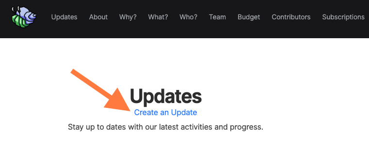

# Updates & Comms

## Updates to Backers

A lot of Collectives like to periodically email their Backers, to let them know what their donations are enabling, express thanks, or notify everyone of a change.

To create an Update, go to your Collective page and click "Create an Update".

You can also send Updates via email using  **backers@$collective.opencollective.com**

_$collective = the slug of your Collective, which appears in your Collective URL_

Updates will be emailed and appear in the Updates section of your Collective page.

## Contacting a Collective

To receive communication via your Collective, senders can email **info@$collective.opencollective.com** to reach the Core Contributors. 

We recommend you share this address, or another email address you prefer, in your Collective description, so people know how to reach you.

