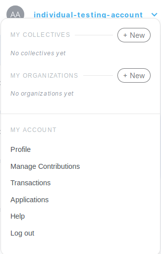
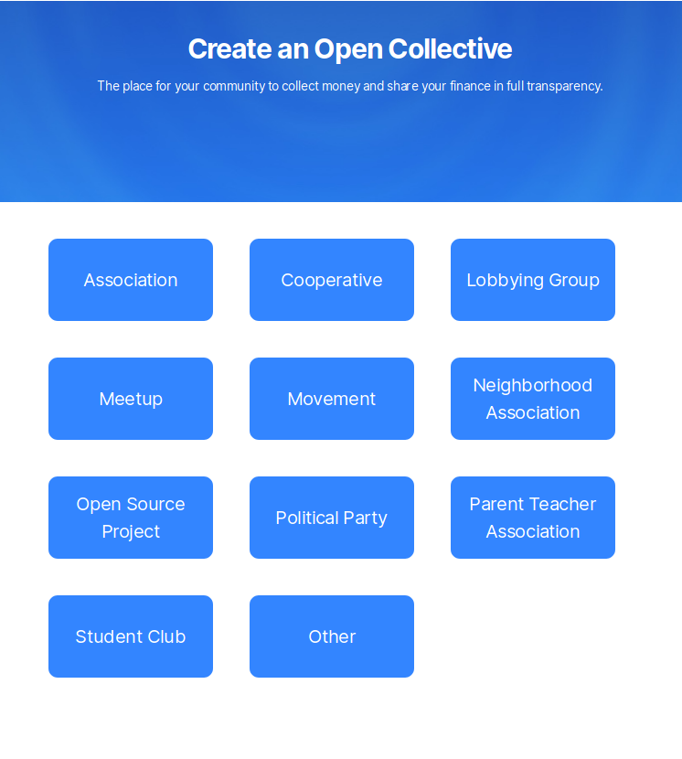

# Creating a Collective

Open Collective allows you to create a transparent funding page for your project in just a few clicks. No need to incorporate, hire a lawyer and accountant, or define organizational roles!

First, reveal the dropdown menu by clicking on your username and click on the **+ New** button under the **My Collectives** section.

Select the category that best describe your Collective.

Some categories have special features. If you select **Open Source Project**, you will be redirected to the [Open Source Collective ](../fiscal-hosts/open-source-collective.md)application page. More on the application process can be found on [OSC Collective Verification](osc-verification.md).

If you select **Meetup**, you will be able to export some metadata from Meetup.com such as tags, name, number of members, short description, tags and city.

After your Collective is created, you will be redirected to the **Fiscal Host** settings. In order to receive or spend money, you'll need to [add a Fiscal Host](add-or-change-fiscal-host.md) by either creating one or applying to an existing Fiscal Host. Once you are finished, check out what to do next on our [Quick Start Guide](quick-start-guide.md)!

