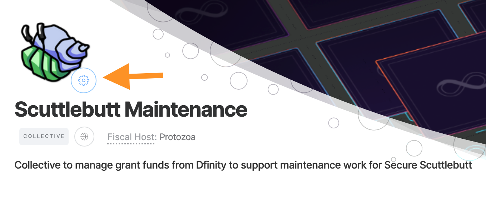
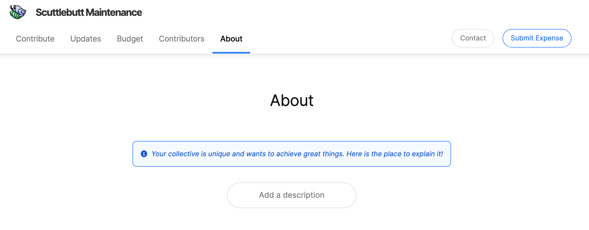
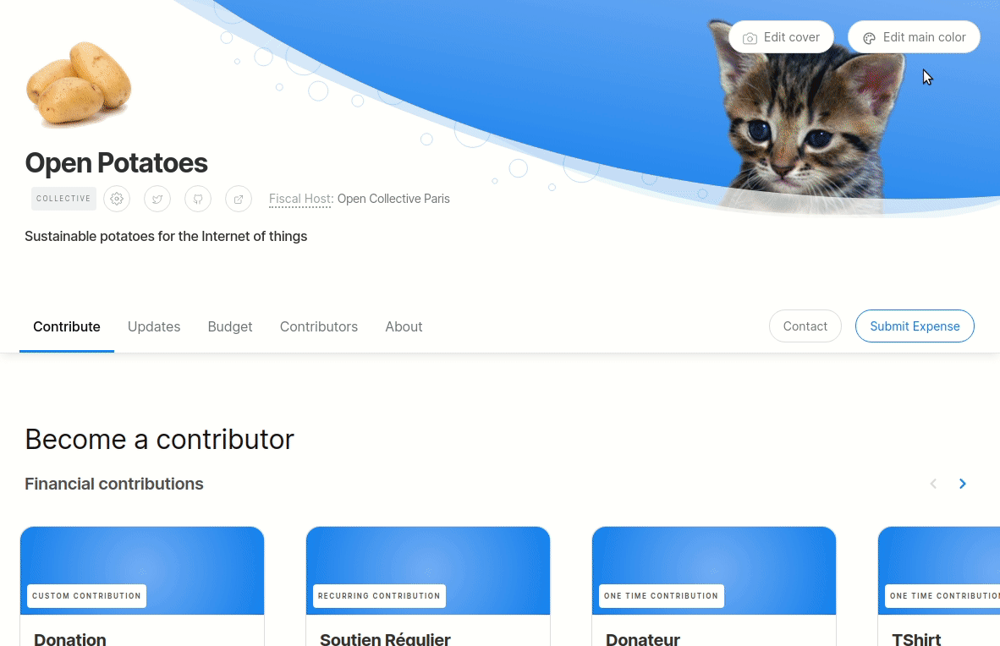
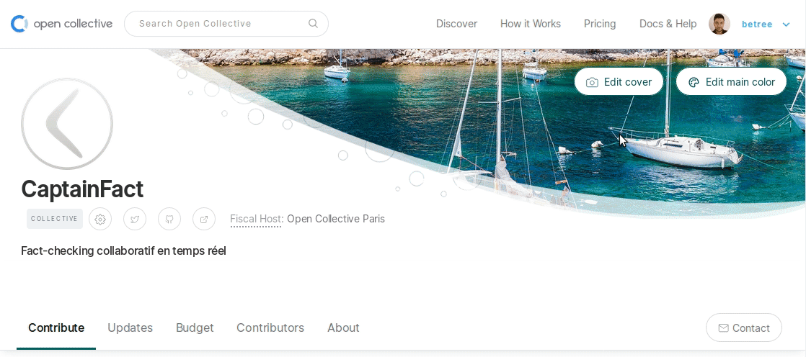

# Customize Collective

## Edit Settings

To access all settings for your Collective, click the cog icon next to your logo image.

## Page Sections

As an admin, all sections will appear in your view, with invitations to add content. However, any sections without content in will not appear to other users \(for example, **Updates** and **About**\).

If you would like to reorder sections or hide one, please contact support and we can action your request. In the future we will enable Collective admins to hide and reorder sections themselves.

## Change Logo

To update your logo image, hover over it and click on **Edit logo**, or simply drag an image file onto the logo area.


All logos are displayed on a white background, so white logos will not be visible. If you want to use a white logo, upload an image with a colored background instead of a transparent one.


## Set Main Color

Your main color determines the color of links and buttons, tier cards, and the hero header if no image is set.

Click on **Edit main color** in the header area to set the color.

## Set Cover Image

To change your cover image, click on **Edit cover**. By clicking on the image, you are able to move it around. You can also zoom in and out as you like.

