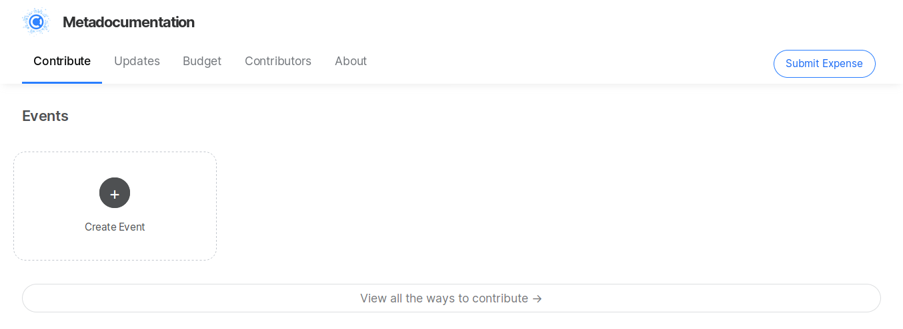

# Events



This functionality is still in experimental phase.


## Create an Event

Log in to your Collective and scroll down to the Events section. Click on the **Create Event** button.



* **Template:** if it's your first event, select no template. If you want to copy a previous event, select it.
* **URL:** the online address your event will have - very important so you don't get a [404 error](events.md#i-cant-see-my-event-listed-or-get-a-404-error).
* **Name** of the event
* **Description:** purpose, schedule, etc
* **Start** date & time
* **End** date & time
* **Location:** the address will load a map

### Tickets & Pricing

You can create several kinds of tickets.

* Type \(backers, sponsor, or ticket\)
* Name \(eg, gold sponsor, free ticket, donation, etc\)
* Description \(what the ticket includes or who it's for\)
* Amount \(price\) can be free or you can charge

You can add more tickets with the "add another ticket" button.

#### Add Images

You'll need to host your image somewhere and link to it with markdown syntax. Use this [Markdown cheatsheet](https://github.com/adam-p/markdown-here/wiki/Markdown-Cheatsheet#images) if you're not sure how. The basic format is:

```text

```

The size of the image should be 750 px wide max.

#### Finally, click the "CREATE EVENT" button.

## Edit or Delete an Event

1. Log in to your Collective
2. Click on the events tab
3. Click on the name of the event
4. Click "EDIT" on the event page

You will now be able to edit your event.

To delete, scroll down to the bottom and click "delete event".

## I can't see my event listed or get a 404 error

You probably forgot to set the URL field when creating the event. Just write to us at [support@opencollective.com](mailto:support@opencollective.com) and we will fix it. Sorry for the inconvenience this may cause you—we are working on improving this.

## Email Attendees

If you want to email your event's attendees, you can do it in two different ways:

1. Login to your Collective, go to the event, and under registered people you should see the option for emailing.  
2. Send an email to _$event@$collective.opencollective.com_ to reach out to all people who RSVPed \($event = the name of your event, $collective = the name of your collective\).

