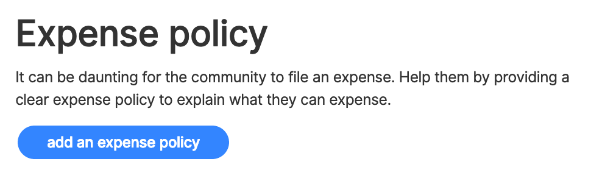

# Expense Policy

You can specify an expense policy, which appears on the top of the submit expense form, to give guidance to expense submitters. Making it clear what expenses will be approved and what submitters need to do will save time for you and them.

To update your expense policy, go to 'edit collective' and click Expenses.

If you have not specified an expense policy, when you view the submit expense page for your Collective, you will see a button asking you to add one.

## Examples

### Webpack

> We distribute the money according to the contributions on Github. There is a minimum threshold. You'll receive a mail when you made enough contributions last month.

### Babel

> Feel free to expense a public transport for a conference/meetup as a community member, or for things like stickers. For core members, transport/stay for things like TC39 meetings. For other expenses you can ask. Otherwise, we plan on spending most of the money trying to pay people full time.

## Fiscal Host Expense Policy

Your Fiscal Host can also set an [expense policy](https://github.com/opencollective/documentation/tree/7991781321e21c71705dddaf37775eeb78dbe972/hosts/fiscal-host-settings.md#expenses). It will appear on the submit expense page, underneath the Collective policy.

Often times, Collective expense policies are focused on what categories of things are allowed as expenses, while the Fiscal Host policy pertains to required documentation, like details on invoices.

