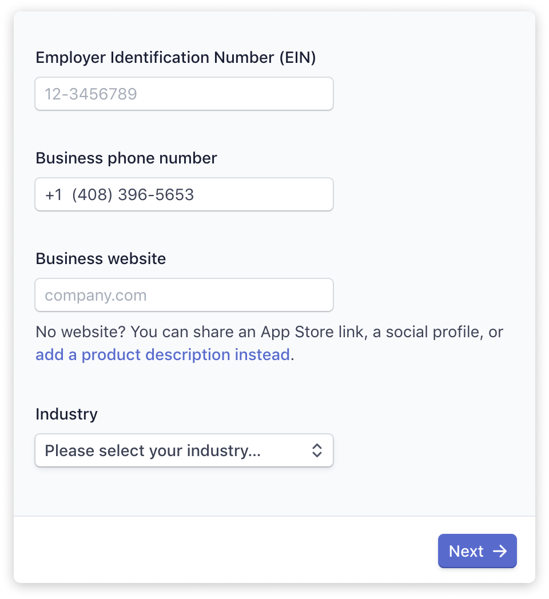

# Setting up GitHub Sponsored Organization

This document is a guide to setting up Stripe Connect using Open Source Collective \(fiscal host to open source projects on Open Collective\), which is necessary in order to receive funds. Open Source Collective will hold funds on behalf of your project in its bank account.

Please note that by using Open Source Collective as your organization’s fiscal host, transaction data about the donations you receive through GitHub Sponsors will be exported on a monthly basis and shared with Open Source Collective so they can credit your Collective’s budget.

## Setting up Stripe Connect

One of the steps in this list is to set up a **Stripe Connect account**. When you first click on the Stripe Connect account link, you will be taken to a Stripe sign up page:

### Country of operation and contact information

You will be asked to select the country where you legally operate from, or receive payouts in.

As Open Source Collective is a US entity, select **United States**.

You may enter your own phone number, which will be used to verify the account. Use an email accessible to the person in your project responsible for sponsorship activities can access to receive Stripe Connect updates.

### Verify your phone number

Next, you will be asked to verify the phone number you gave:

Once the phone number is verified, you will start filling out details about the fiscal host, Open Source Collective.

### Business details \(about Open Source Collective\)

This next section is asking questions about the business. As a Collective fiscally hosted by Open Source Collective, you need to enter OSC’s details here.

* Legal business name: `Open Source Collective`
* Doing business as: `Name of your collective`
* Business website: `https://opencollective.com/your_collective_slug`

### Executive details \(about you\)

Next, you will be filling out details as the acting executive for the Collective. Use your personal information on this page.

### Payout details

Finally, you will input bank account information. Funds you receive through GitHub go to Open Source Collective’s bank account, so they can credit the money to your Collective’s budget on Open Collective.

* Routing number: `123205054`
* Account Number: `4864122233`

After that, you should be all set! ✌️😎

## Frequently Asked Question

### What fees will be charged?

The standard Open Collective and Open Source Collective fees apply to funds raised via GitHub Sponsors: 10% total. There are also payment processing fees from Stripe. GitHub does not charge a fee.
