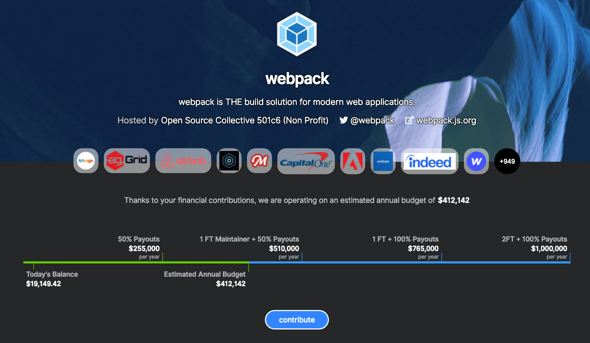
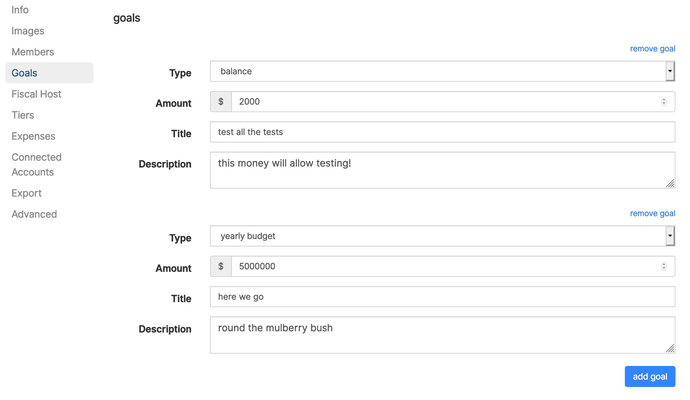

# Goals

Set goals to share the funding milestones your project is aiming for, and what could be possible at different levels of support.

Goals help inspire backers and sponsors to give, because they can get excited about what their contribution can enable.

To add a Goal, go to 'edit Collective' and click 'Goals'.

