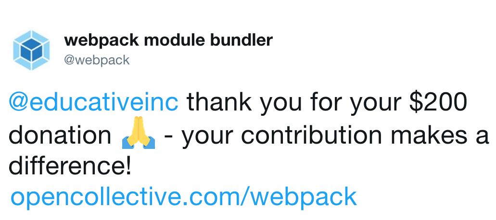

# Integrations

## Twitter Integration

Connect your Twitter to automatically thank new backers who contribute to your Collective.

Go to "edit Collective" &gt; "Connected Accounts" and click the "Connect Twitter" button. 



## Chat Integrations

You can set up Open Collective notifications in your Slack or Gitter channel. First set up a webhook, described below, and then [send it to us](mailto:ops@opencollective.com?subject=slack%20integration) and we'll add the hook to our platform.

### Slack Webhook

* In Slack, select menu Apps & Integrations
* Click Build Your Own &gt; Make a Custom Integration &gt; Incoming WebHooks
* Choose a channel, or create a new channel, where the notifications will be sent
* Click Add Incoming WebHooks Integration

### **Gitter Webhook**

* Go to your room's integrations and click Open Collective
* Copy the provided Webhook URL and click Done

### For Admins

The webhook can be added in the database `Notifications` table:

```text
INSERT INTO "Notifications" (
  "GroupId",
  channel,
  type,
  active,
  "webhookUrl")
VALUES ((SELECT id from "Groups" where slug = '<group slug>'),
        '<channel: either slack or gitter',
        '<type: see note below>',
        true,
        '<webhook URL>');
```

`type` \(would actually be more properly named `activity`\) can be:

* either `'all'` \(\*\) to send notifications for all activities \(group transaction created, payment received from Stripe, etc\)
* or some constant from [here](https://github.com/OpenCollective/opencollective-api/blob/master/server/constants/activities.js) to only send notifications for a specific activity

[Some activities](https://github.com/OpenCollective/opencollective-api/blob/master/server/constants/activities.js#L6) are not linked to any group and will therefore be ignored.

