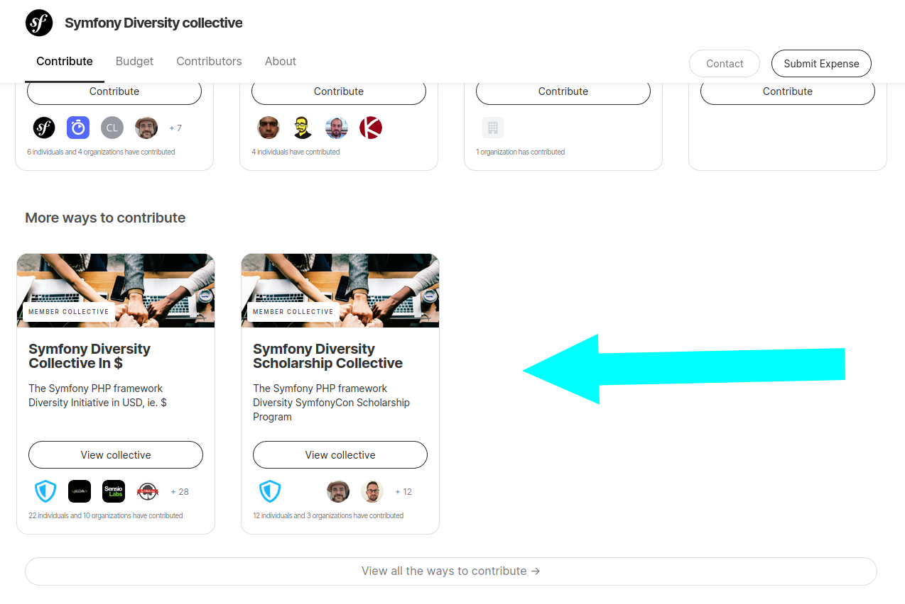
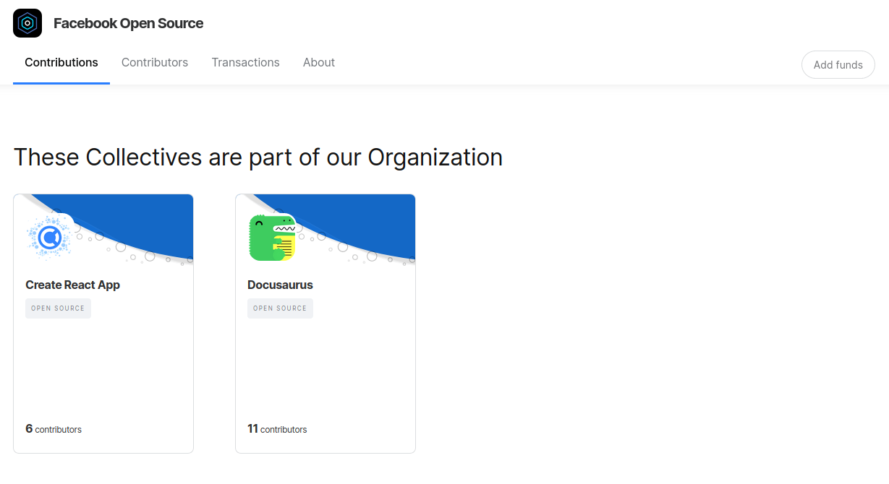

# Subcollectives


Creating subcollectives is [a manual process](../internal/queries/subcollective-queries.md) at the moment. If you want to do it, please send an email to [support@opencollective.com](mailto:support@opencollective.com) describing what you'd like.


Subcollectives are a way to display the different collectives or local projects that came out of your main initiative. Collectives are not strongly tied together:

* They **don't** share the same budget
* They can have different hosts, with different currencies
* Admins of one Collective are **not** automatically admin of the other

On the Collective page, subcollectives will be displayed under `More ways to contribute` 

Subcollectives feature works for Organizations and Users profiles too:

