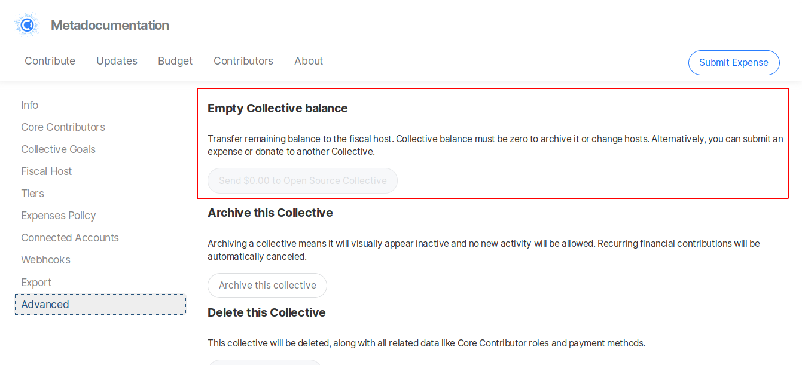

# Zero Collective Balance

Before [changing hosts](add-or-change-fiscal-host.md#changing-fiscal-host) or [closing a Collective](closing-a-collective.md), the balance must be at zero.

You can move money out of your Collective in several ways:

* [Submitting expenses](../expenses-and-getting-paid/submitting-expenses.md) to withdraw funds.
* [Donating to another Collective](../financial-contributors/collectives/collective-to-collective-donations.md) in the same fiscal host.
* Giving the remaining balance to your Fiscal Host. You can access that option by visiting your Collective's page, clicking on the gear icon next to your logo, and heading to the **Advanced** page.

## Leftover Balance

Due to the design of the Open Collective system, sometimes if you try to withdraw 100% of your balance, a small amount will be unintentionally left behind. This is usually caused by fees being hard to predict exactly.

If this happens, go to to your Collective's page, click on the gear icon next to your logo, head to **Advanced** and use the **Empty Balance** button to transfer the remaining funds to your Fiscal Host.

