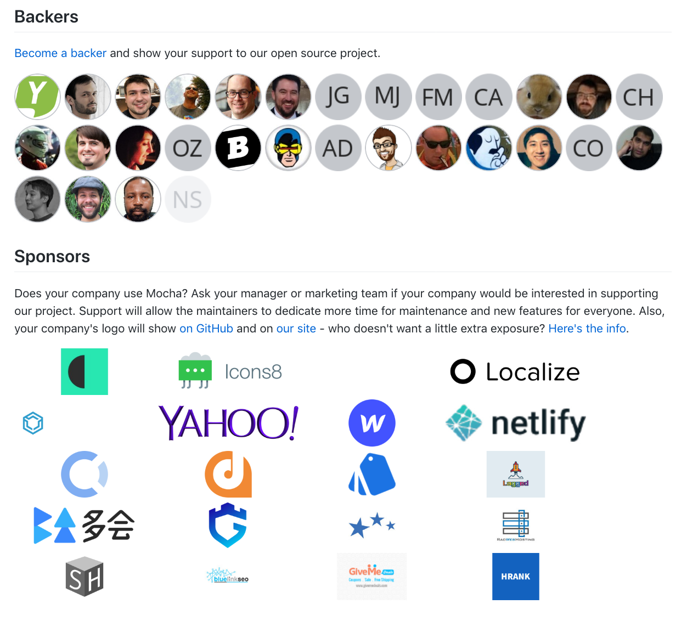

# README Integration



To get help generating an integration like [this](https://github.com/mochajs/mocha#backers) or [this](https://github.com/babel/babel#sponsors), follow these steps:

1. Install [Macdown](https://macdown.uranusjr.com/) to make it easy to compare PRs in the last step
2. Install `opencollective-setup`

   ```text
   $ npm install -g opencollective-setup
   ```

3. Get a personal token from [GitHub's token page](https://github.com/settings/tokens). Check all the `repo` related permissions.
4. Create a file in your home directory \(on Mac OS X or Linux\) called `.opencollective.json` and add token in it:

   ```text
   { "github_token": "[YOUR_TOKEN]" }
   ```

5. Run cli for a given repo:

   ```text
   $ opencollective-setup setup -r [repo_owner/repo_name] -i
   ```

   Ex: To integrate with MochaJS \([https://github.com/mochajs/mocha](https://github.com/mochajs/mocha)\), run:

   ```text
   opencollective-setup -r mochajs/mocha -i
   ```

   `-i` makes it interactive.

6. Answer questions asked by the script - usually defaults are good to go with. Verify that the slug of project is same as the one in the database \(script guesses at it and is usually right\).
7. Script attempts to do several integrations across README.md, CONTRIBUTORS.md and ISSUE\_TEMPLATE.md. Most important ones are the two integrations on README.md: backers and sponsor badges at the top and adding backer/sponsor section near the bottom.

