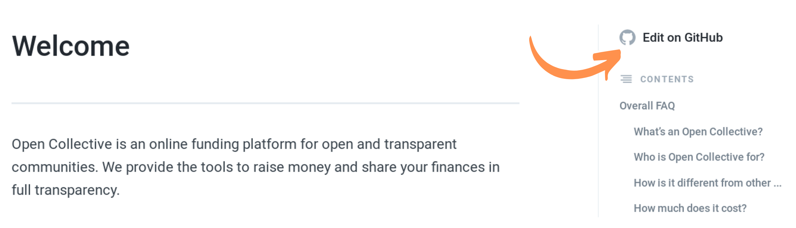
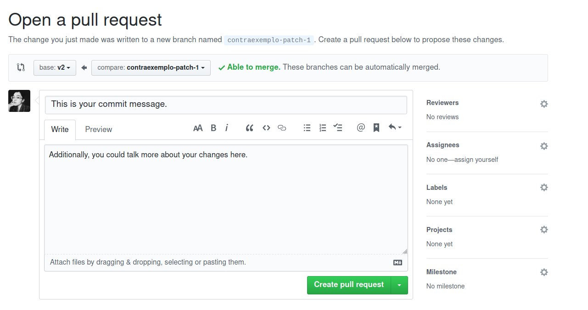
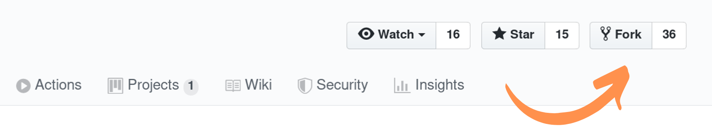
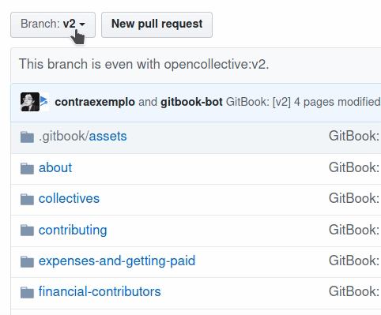
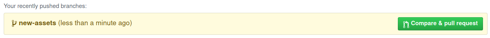
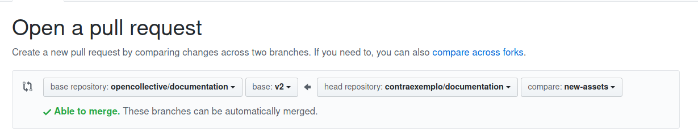
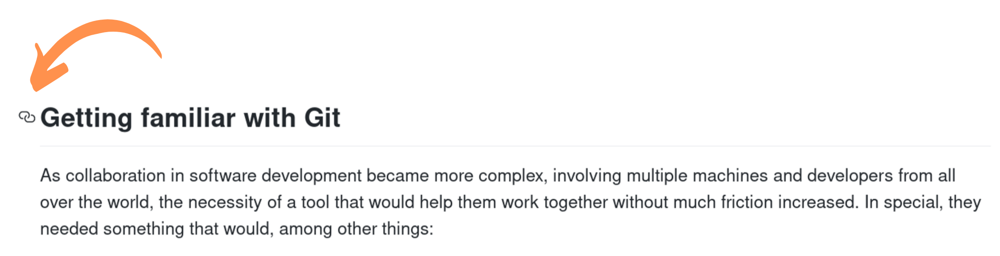
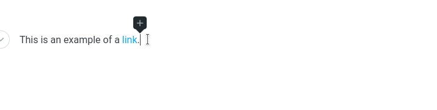

# Suggesting changes

Want to make our documentation even better? First of all, thank you! This page will guide you through our contribution process, presenting you to:

* The tools we use to build our documentation
* The steps you need to follow to make contributions

To edit our docs, you must have a GitHub account. If you already have one, make sure you are logged in. If you don't, please [create one](https://github.com/join). We also recommend you to read our [style guide](style-guide.md) before submitting any changes. It serves as a reference of our writing style and our expectations for documentation.

## Getting familiar with Git

As collaboration in software development became more complex, involving multiple machines and developers from all over the world, the necessity of a tool that would help them work together without much friction increased. In special, they needed something that would, among other things:

* Avoid conflicts when working with the same codebase simultaneously
* Alert each developer if there were new updates to the source code before publishing new changes
* Manage file differences
* Help investigating what changes caused an error or a break
* Revert any changes if needed

They needed _distributed version control system_.

**Git** is one of the most popular distributed version control systems used in free and open source projects. Websites such as **GitLab**, **GitHub** or **Bitbucket** are some of the most popular platforms for hosting git **repositories** \(a place where all relevant files to a project are stored\). For instance, our documentation is stored in a repository called [documentation](https://github.com/opencollective/documentation) on our organization profile on GitHub, [opencollective](https://github.com/opencollective). And if you **clone** our repository \(that is, make a copy our repository to your computer\), you'll copy not only all of our files but also the history of all changes they went through since it was created \(including who authored them\)!

This page will cover interactions with our repository through **GitHub**, the platform on which we host our projects. This is the recommended process for those who aren't familiar with Git. If you are a more experienced contributor, feel free to adopt any other workflow you want, but remember to always take into account [GitBook's integration with GitHub](suggesting-changes.md#understanding-gitbooks-integration-with-github) when [modifying](suggesting-changes.md#editing-existing-pages) or [adding new files](suggesting-changes.md#adding-new-media), [sections, pages and subpages](suggesting-changes.md#adding-new-sections-pages-and-subpages).

If you'd like to know more about Git and GitHub, we recommend Git's [official documentation](https://git-scm.com/) and [tutorial](https://git-scm.com/docs/gittutorial) and [GitHub Guides](https://guides.github.com/).

## Understanding GitBook's integration with GitHub

We use a platform called [GitBook](https://www.gitbook.com/) to host, manage and serve our documentation. GitBook fetches files from our GitHub repository **opencollective/documentation**, reads them and converts them into the pages you can access on **docs.opencollective.org**. A generic structure of a documentation hosted on GitBook would look like this:



```text
First page
├── A group of pages

│   ├── A page
│   ├── Another page
│   ├── One more page
│   │   ├── A nested page
│   │   └── Another nested page
```



Its mirror to GitHub, on the other hand, would have the following structure:



```text
├── .gitbook/
│    └── assets/
│    │    └── an-image.png
├── a-group-of-pages/
│    ├── a-page.md
│    ├── another-page.md
│    ├── one-more-page/
│    │    ├── README.md
│    │    ├── a-nested-page.md
│    │    └── another-nested-page.md
├── README.md
└── SUMMARY.md
```



* The `.gitbook/assets` folder manages every file used in any page.
* The `SUMMARY.md` file tells GitBook in which order we wish to display our pages and what groups there are in our documentation.
* The `README.md` file in the main folder has the contents of the first page users see when accessing the documentation website.
* Groups of pages are controlled by folders named after the group title \(i.e. `a-group-of-pages`\).
* Nested pages have a similar structure to groups of pages; however, a `README.md` file with the contents of the parent page must be added to the folder named after the parent page title.

GitBook also created a few shortcodes for special attributes. Learn more about them reading our [style guide](https://github.com/opencollective/documentation/tree/0c915d6173307139ebeaaa50dccaba7d7149c9b2/contributing/documentation/style-guide/README.md#special-attributes).

## Editing existing pages

**1.** Open the page you want to edit. What you see next depends on the resolution of your screen and on whether you are viewing that page zoomed in or not.

**a.** On certain occasions, you may see a button saying **Edit on GitHub** above the **Table of Contents** on the right side of the page.



**b.** On others, you may see a GitHub icon on the top of page, next to the title and to the Table of Contents icon.


**2.** Click on the GitHub icon. This will direct you to the Markdown file in which the contents of the page are stored.

**3.** Click on the pencil icon \(labeled "Edit this file"\). This will open a basic editing environment in which you are able to costumize aspects like line wrap and indentation.


**4.** Make any edits you need, remembering to always format them using Markdown. To understand better GitBook's implementation of Markdown, check [their reference guide](https://docs.gitbook.com/content-editing/markdown) and our [style guide](https://github.com/opencollective/documentation/tree/0c915d6173307139ebeaaa50dccaba7d7149c9b2/contributing/documentation/contributing/documentation/style-guide/README.md).

**5.** When you are done making changes, scroll down and write a short description of your changes. Select the option **Create a new branch for this commit and start a pull request** and click on **Propose file change**. This will direct you to the **Pull request** page.


**6.** On the **Pull request** page, write a short comment explaining why are proposing those changes \(e.g. improving readability, covering cases that weren't mentioned, adding critical details about our platform\) and publish your pull request clicking on **Create pull request**.




Congratulations, you submitted a pull request! 🎉 Our documentation admins will review it and merge them to our documentation if approved.


## Adding new media and using it in pages

Media of any kind \(images, GIFs...\) should be stored on the **.gitbook/assets** folder.


Any new media you add to the documentation should be named following this naming scheme:

```text
Documentation_section_Page_in_which_it_will_be_added_Brief_description_YYYY-MM-DD
```

Here's how it looks like for media added to the **Suggesting changes** page:

```text
Contributing_Documentation_Suggesting_changes_New_pull_request_2019-04-29.png
```


**1.** Clone our documentation repository to your account.

**a**. Click on the **Fork** button at the top of the page.



**2.** On your copy of the repository, create a new branch by clicking on **Branch: v2**, writing **new-assets** and selecting **Create branch: new assets**.



**3.** Click on the **.gitbook/assets** folder and then click on **Upload files**. You can drag and drop any files you wish to add or find them with your file manager clicking on **choose your files**. Commit your changes.


**4.** Open the file of the page you want to edit. To embed media to the page, write:

```text

```

**5.** GitHub will automatically detect your new changes and give you the option to **Compare and pull request**. Click on it.



**6.** Create your pull request normally. The base repository should be **opencollective/documentation** using the **v2 branch** as the base and the head repository should be **your fork** using the **new-assets** branch as a comparison.



## Adding new sections, pages and subpages


Please create an issue on our documentation repository to discuss your ideas before taking any action.

1. Go to [**our Issue section**](https://github.com/opencollective/documentation/issues) and click on **New issue**. 
2. Describe what changes you are proposing and the motivation behind them: how will them improve our documentation? How should we proceed?
3. Click on **Submit new issue**.


**0.** Follow the same procedure to make a copy of our documentation repository as described on the **Add new images** section. Name your branch **new-pages**, **new-section** or **new-subpages** accordingly.

**1.** To add a new file or folder, click on **Create new file**.


To create a Markdown file, remember to write the name of the file and add the `.md` extension.


**a.** If you want to add a new page to an existing section of the documentation, click on the proper folder and then click on **Create new file**. Name your Markdown file and start writing.


Remember: Your page will be named after the first h1 heading on your Markdown file, and not the name of the file.


**b.** If you want to add a new section to our documentation, click on **Create new file** directly. Write the name of the section and press `/` as many times you need. Add either a `README.md` file or a normal Markdown file with any name you want.


Remember: `README.md` creates a page with the same name of your new folder. Markdown files with any other name will create pages with a title using the first h1 heading.



**2.** GitHub will automatically detect your new changes and give you the option to **Compare and pull request**. Click on it.

**3.** Create your pull request normally. The base repository should be **opencollective/documentation** using the **v2 branch** as the base and the head repository should be **your fork** using the right branch as a comparison.


Don't forget to add any new pages to the `SUMMARY.md` file, and remember to link them to their source file. New unsorted pages should be added as items on an unordered list:

```text
* [New page](folder/new-page/README.md)
  * [New subpage](folder/new-page/new-subpage.md)
* [Another new page](folder/another-new-page.md)
```

New sections should be added as h2 headings:

```text
## New section
* [New page](folder/new-page.md)
```


## Creating links to other pages or sections of a page

Linking other pages or sections of a page is done in a similar manner to changes to the summary.

To link another page, write:

```text
[Page](page.md)
[A page within a folder](folder/page-within.md)
```

To link a specific section of a page, write:

```text
[Specific section in a page](page.md#specific-section)
```

The text after `#` symbol \(a hash\) is an element called **anchor**. On GitBook, anchors are created by replacing every blank space in a section title with `-` \(hyphens\). Therefore,

* Getting familiar with Git becomes `#getting-familiar-with-git`
* Understanding GitBook's integration with GitHub becomes `#understanding-gitbooks-integration-with-github`

If you aren't sure how an anchor will look like, you can use GitHub to assist you: on every Markdown file, GitHub generates anchors for each section of that document. Click on the two links on the left side of the section title to see the anchor on your browser's address bar.



## Dealing with dead internal links

Sometimes you may find broken internal links. If you find one, please open an issue about it on [opencollective/opencollective](https://github.com/opencollective/opencollective)—we will follow up shortly.

But if you have access to the GitBook interface, here's what you should do to fix it yourself:

1. Check the `master` branch on GitHub for an old version of the page with the broken link. That will help you figure out to which page that link was originally pointing to.
2. Sometimes it will be just a matter of updating `.gitbook.yaml` to point that specific path to the right page. But other times \(probably when we make aggressive changes to the folder structure—their versioning system doesn't seem to like it that much\), you will have to update that link manually. To do so, hover your mouse to the old link and edit it by searching for the title of the page to be mentioned.



If you have any other questions about contributing to our documentation, please reach out to support@opencollective.com or join our `documentation` channel on [Slack](https://opencollective.slack.com).

