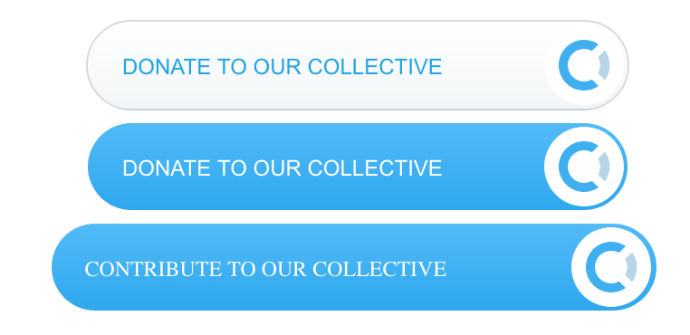
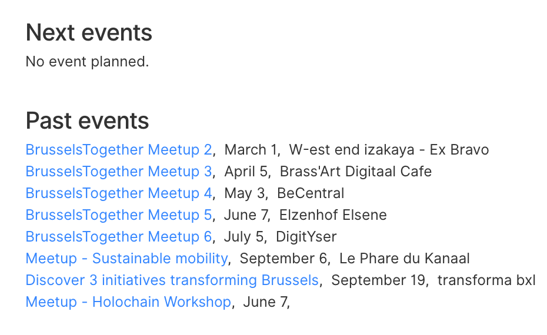
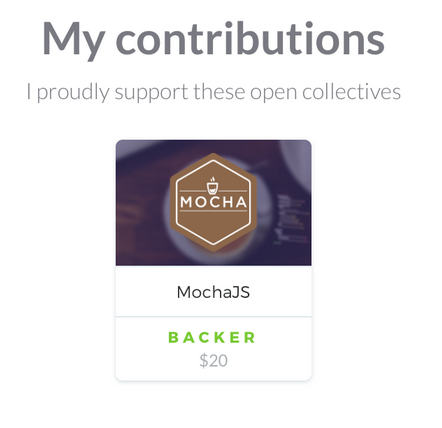

# Buttons & Banners

## Github Banner

You can automatically add backers and sponsors to the README.md of your Github repository. [See an example](https://github.com/apex/apex#backers).

1. Go to [https://opencollective.com/:yourcollective/banner.md](https://opencollective.com/:yourcollective/banner.md)
2. Copy the HTML to your clipboard
3. Paste the HTML in your `README.md` file
4. Add these badges [](https://github.com/opencollective/opencollective/wiki/Github-banner#backers) [](https://github.com/opencollective/opencollective/wiki/Github-banner#sponsors) at the top of your `README.md` file :

```text
[](#backers) 
[](#sponsors)
```

[Example](https://github.com/parcel-bundler/parcel/pull/228/files)

### How does it work?

Our server returns a 1px transparent image for all spots that are still empty. Whenever there is a new backer or sponsor, we return the avatar or logo in the right position. There is just a few minutes of delay because Github caches the images.

## Website Widgets

### For Collectives

#### Donate button

```text
<script src="https://opencollective.com/:collectiveSlug/:verb/button.js" color="[white|blue]"></script>
```

Just replace `:collectiveSlug` with the slug of your Collective \(e.g. webpack for [https://opencollective.com/webpack](https://opencollective.com/webpack)\). The verb can either be "donate" or "contribute".



If you want to add a donate button to a blog post, you can load an image version of the logo and then link to the donate page of your collective.

```text
<a href="https://opencollective.com/webpack/donate" target="_blank">
  
</a>
```

Result:[](https://opencollective.com/webpack/donate)

On Medium, download the image then upload it to your post. To link it, select the image and press CMD+K \(or CTRL+K on Windows\). A pop up menu will show up where you can enter the URL to link the image to \(see [Medium support page](https://help.medium.com/hc/en-us/articles/115004808847-Image-links)\). Here is an [example](https://medium.com/open-collective/open-collective-donate-button-e7e6d5965b2c).

#### Show backers and sponsors <a id="show-backers-and-sponsors"></a>

Just add this script:

```text
<script src="https://opencollective.com/:collectiveSlug/banner.js"></script>
```

where `:collectiveSlug` is the slug of your collective, e.g. `apex` for [https://opencollective.com/apex](https://opencollective.com/apex).

You can also add a style object \(react style\), e.g.

```text
<script src='https://opencollective.com/:collectiveSlug/banner.js?style={"a":{"color":"red"},"h2":{"fontFamily":"Verdana","fontWeight":"normal","fontSize":"20px"}}'></script>
```

Note: make sure that your style object is parsable with `JSON.stringify`.

**Examples:**

* [http://apex.run/\#links](http://apex.run/#links)
* [https://www.spinacms.com/](https://www.spinacms.com/)

**How to customize?**

By default, it uses the default styling of your `h1` and `h2` on your page. You can target them with CSS to customize:

```text
#opencollective-banner h1 {
  color: black;
}
```

#### Show next events <a id="show-next-events"></a>

```text
<script src="https://opencollective.com/:collectiveSlug/events.js" width="500"></script>
```

Example:



### For backers and sponsors <a id="for-backers-and-sponsors"></a>

To show the list of Collectives that you are backing on your website, just add this script:

```text
<script src="https://opencollective.com/:username/collectives.js?role=backer"></script>
```

You can replace `backer` by `admin` \(core contributor\), `member` \(contributor\) or `host`. Leave it empty or remove it to show all the collectives that you are a member of, irrespective of the role.



