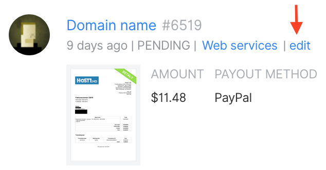

# Edit an Expense

If you have entered incorrect information on your expense and it has not yet been approved, you can click "edit" to fix the error. Remember to save your changes.

Unapproved expenses can be edited by the user who [submitted](submitting-expenses.md) them and the [Fiscal Host](../hosts/) admin. 

Once an expense has been approved, it can only be edited by the Fiscal Host admin. If you need to edit an expense that's already been approved, you can put a comment on the expense explaining the situation and the admin should reply. 

If you submitted an expense in error, Core Contributors can reject it and you can re-do it with correct information, or if it's already approved the host admin can kick it back to unapproved status.

Making changes to an approved expense means it will need to be approved again before it's paid.

Once you have made your edits, click the "save" button.

