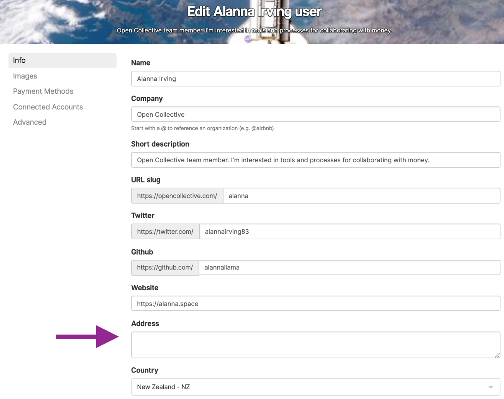
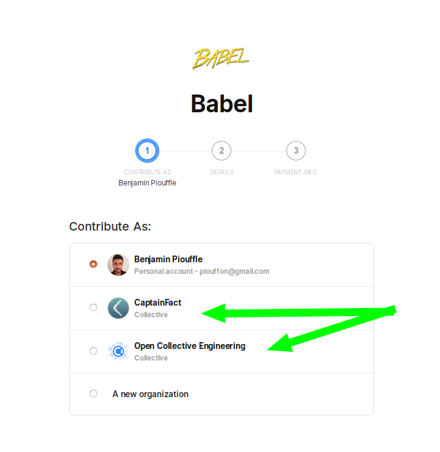

# FAQ

## Why should I give to a Collective?

If you get value out of what a project produces, support them to maintain it well and make improvements. You can also get recognition by appearing on their page as a backer or sponsor.

## How do I contribute financially to a Collective?

Go to the Collective page of the project you want to support. Select a contribution tier and set up a recurring donation, or click "one time donation" to make a one-off payment.

## How can I find Collectives to support?

Check out the [Discover](https://opencollective.com/discover) page or do a search.

You can also find dependencies using [Back Your Stack](https://backyourstack.com/).

## What payment methods can I use?

Right now we only support credit card payments via Stripe through the platform. It is possible to pay by other means, such as bank transfer or Paypal, by special agreement with a Collective and their [Fiscal Host](https://github.com/opencollective/documentation/tree/7991781321e21c71705dddaf37775eeb78dbe972/hosts/README.md).

## Are my donations tax deductible?

It depends on the [fiscal host ](https://github.com/opencollective/documentation/tree/7991781321e21c71705dddaf37775eeb78dbe972/hosts/README.md)of the Collective. If the host has tax-exempt status, then your donation can be tax deductible. It also may matter which country the host is in, if your country only allows tax exemptions for domestic transactions.

The Open Source Collective 501\(c\)\(6\) is a non-profit that serves as fiscal host to most open source software projects on Open Collective. **Donations to Collectives under the Open Source Collective 501\(c\)\(6\) are not tax deductible.**

Unfortunately, the IRS does not consider producing open source software to be a charitable activity in and of itself, and therefore does not grant tax exempt status. Also, the Open Source Collective hosts projects around the world, and the US only grants tax deductible status to explicitly US-focused entities.

In contrast, the Open Collective Foundation 501\(c\)\(3\), which is home to many open-source related groups primarily focused on education, outreach, and social impact, does qualify for tax-exempt status. If you donate to a Collective under that host, it's tax deductible in the US.

## Can I update the billing address on my receipts?

Yes. To do so, go to 'edit profile' and fill in the address field. You can also add your company name here if needed.

## Can my Collective give to another Collective?

If both Collectives are in the same [fiscal host](https://github.com/opencollective/documentation/tree/7991781321e21c71705dddaf37775eeb78dbe972/hosts/README.md), you can donate using the balance of a Collective. For example, most open source projects are hosted by the Open Source Collectives, so they can give to each other.

To make a Collective-to-Collective donation, go to the page of the Collective and select your contribution amount. You will be given the option to donate from any Collective you are a core contributor of.

## Can I leave a message with my donation?

Yes. You will be given the option to write a note with your contribution.

