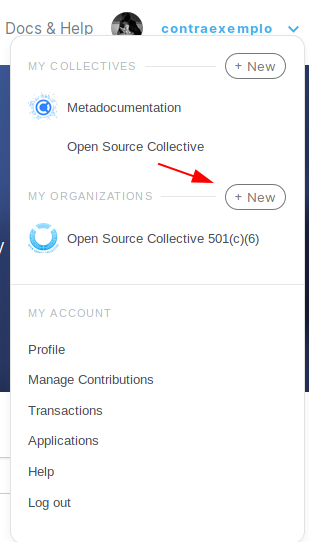
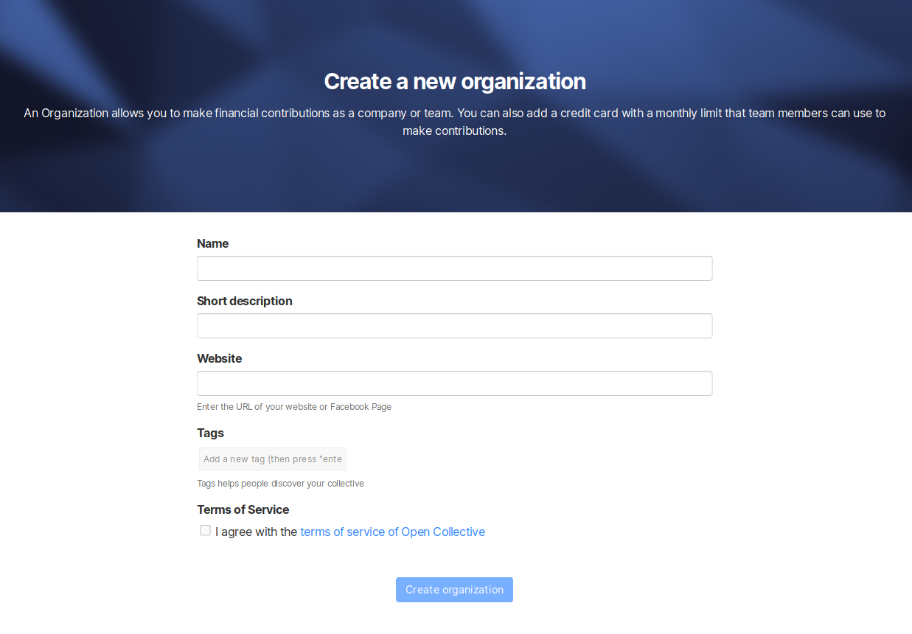
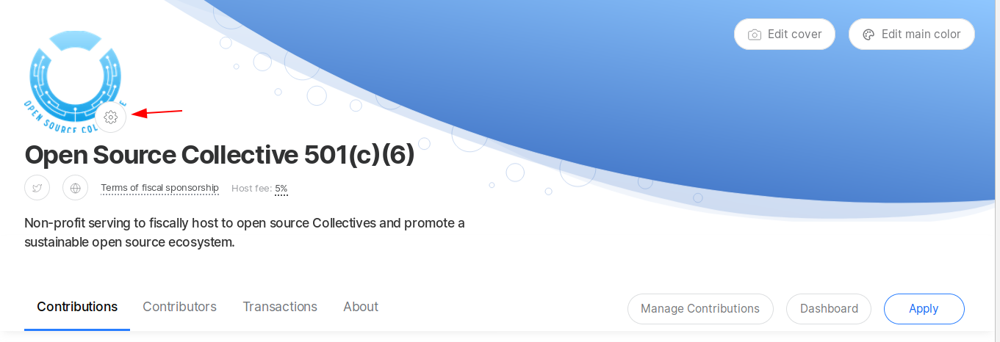
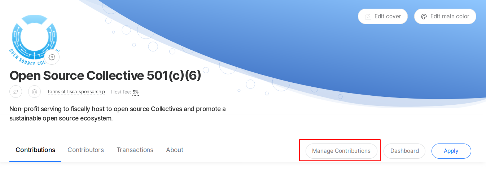

# Organizations

## What is an Organization?

An Organization is a profile that represents a a legal entity instead of an individual. Companies that become Financial Contributors, as well as legal entities that are Fiscal Hosts, are all Organizations on Open Collective.

## Why Create an Organization?

* Have your company show up as a Financial Contributor of Collectives
* Enable your employees to support Collectives on behalf of your company
* Make [bulk transfers](bulk-transfers.md) so you can send money once and distribute it to Collectives as you wish
* Create a profile to host \(become a Fiscal Host\) for a project. [Read more about Fiscal Hosts](../../fiscal-hosts/fiscal-hosts.md)

## **How to** Create an Organization

### **If you already have an individual profile**

Go to your profile menu \(top right\) and look for the My Organizations section. Click **+New**. 

Once set up, you will be able to select your individual or organization profile when making a contribution.

### **If you don't have an individual profile yet**

Go through the process of contributing to a Collective, and you'll be able to create both the individual and organization profile during check out.

## How to Edit an Organization

Head to the top right menu to navigate to your Organization profile \(make sure you're logged into your Organization, not your personal account\).

Click on the gear icon next to your logo to change your **Info**, add or remove **Core Contributors**, create or edit your **Expenses Policy**, ****manage your **Payment Methods**, **Gift Cards**, **Connected Accounts**, **Webhooks** and to access **Advanced** settings.

Don't forget to **save your changes**!

## **How to access an Organization's contributions**

To access your Organization's contributions, go to the Organization's page and click on **Manage Contributions** in the navigation bar menu. From there you can access the action options to update amount or payment method, or cancel the contribution.

