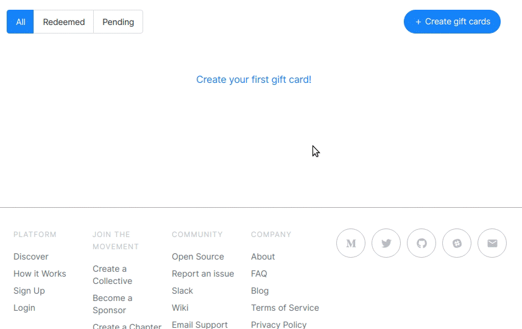

# Gift Cards

See our dedicated [Gift Cards](https://opencollective.com/gift-cards) page for an introduction to gift cards.

## FAQ

### What happens if the gift cards are not used?

You are only charged when the gift cards are used. If you give away a $50 gift card to 10 of your employees and only 8 used it, you will only be charged $400.

### Do I get an invoice?

Yes, you will receive a proper consolidated monthly invoice from the [Open Source Collective 501c6.](https://opencollective.com/opensource)

### Is there an expiry date?

By default gift cards expire after one year, but you can define your own expiry date. If they are not used by the expiry date, they become inactive and you will not be charged.

### I received a gift card—do I need to spend it all in one go?

No. You can use your gift card to give any amount to one or multiple collectives, as long as you have enough balance on the card.

### Who will show up as a backer? My company or my employee?

Both! The person to whom you gave the gift card is the one picking the collectives they want to support. But their donation will show that they used a gift card from your company, and your company will show up as a sponsor of the collective. See for example [Triplebyte](https://opencollective.com/triplebyte) showing up as a sponsor of [Electron](https://opencollective.com/electron).

## Create gift cards

To create Gift Cards for your [Organization](https://github.com/opencollective/documentation/tree/7991781321e21c71705dddaf37775eeb78dbe972/financial-contributors/organizations/organizations.md), go to **Edit Organization** and then **Gift Cards**. From there you'll also be able to see your pending and redeemed gift cards.

We currently offer three options for gift cards distribution.

### 1. By email - Fast & Easy, but no customization possible

You can give us a list of emails and we'll send the gift cards out, or you can generate gift card codes and send them out yourself.

### 2. Download the list of redeem codes/links - Perfect for custom materials

_This section has not been written yet. Help us by sharing your knowledge!_

### _3._ Download a PDF with printable gift cards - To distribute at events

_This section has not been written yet. Help us by sharing your knowledge!_

