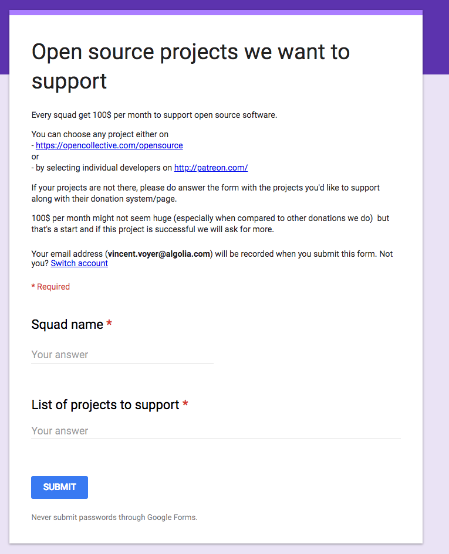

# Sustainer Resources

Convincing 'the powers that be' in companies to sustainably support open source is not easy. We acknowledge that there are many heroes inside companies who are fighting that, and we want to support them. This is an open toolkit for sustainers making the case for their companies to support their open source stack.

## Templates

### Email Template

#### Explain the benefits of financial contribution

[**Google Doc**](https://docs.google.com/document/d/1yViQ4Qq9aqRMfoApTxaHXtG7DDhTFmcfmAencw8ereU/edit?usp=sharing)

_This is an email that Vincent Voyer and Josh Dzielak from Algolia used to start a conversation internally about supporting Open Source. They kindly agreed to share it. &lt;3_

### Google Form Template

## Testimonials

### From Maintainers

_Please keep adding them &lt;3_

Thanks [@opencollect](https://twitter.com/opencollect?ref_src=twsrc%5Etfw) for providing this great service! [@fbOpenSource](https://twitter.com/fbOpenSource?ref_src=twsrc%5Etfw) Thanks for all your contributions to OSS 🙌 [https://t.co/NxnvC8Xi4f](https://t.co/NxnvC8Xi4f)— JS.coach \(@\_jscoach\) [November 14, 2017](https://twitter.com/_jscoach/status/930429575867355136?ref_src=twsrc%5Etfw)

&lt;blockquote class="twitter-tweet" data-dnt="true"&gt;&lt;p lang="en" dir="ltr"&gt;💸Small yet significant step in the &lt;a href="https://twitter.com/hashtag/mobx?src=hash&amp;ref\_src=twsrc%5Etfw"&gt;\#mobx&lt;/a&gt; community. Today I could paid contributor for a significant contribution to MST from our &lt;a href="https://twitter.com/opencollect?ref\_src=twsrc%5Etfw"&gt;@opencollect&lt;/a&gt;!&lt;br&gt;&lt;br&gt;👏 Tnx to &lt;a href="https://twitter.com/coinbase?ref\_src=twsrc%5Etfw"&gt;@coinbase&lt;/a&gt; &lt;a href="https://twitter.com/algolia?ref\_src=twsrc%5Etfw"&gt;@algolia&lt;/a&gt; &lt;a href="https://twitter.com/fbOpenSource?ref\_src=twsrc%5Etfw"&gt;@fbOpenSource&lt;/a&gt; &amp; all other sponsors! &lt;br&gt;&lt;br&gt;🎉It works even when you&\#39;re not &lt;a href="https://twitter.com/webpack?ref\_src=twsrc%5Etfw"&gt;@webpack&lt;/a&gt; &lt;a href="https://t.co/NJTnMcA8NI"&gt;https://t.co/NJTnMcA8NI&lt;/a&gt;&lt;/p&gt;&mdash; Michel Weststrate \(@mweststrate\) &lt;a href="https://twitter.com/mweststrate/status/1018928640388730880?ref\_src=twsrc%5Etfw"&gt;July 16, 2018&lt;/a&gt;&lt;/blockquote&gt; &lt;script async src="https://platform.twitter.com/widgets.js" charset="utf-8"&gt;&lt;/script&gt;

[https://twitter.com/mweststrate/status/1018928640388730880](https://twitter.com/mweststrate/status/1018928640388730880)[https://twitter.com/devongovett/status/1016415051190714368](https://twitter.com/devongovett/status/1016415051190714368)[https://twitter.com/TheAlexLichter/status/1039213736962220032](https://twitter.com/TheAlexLichter/status/1039213736962220032)[https://twitter.com/left\_pad/status/923696620935421953](https://twitter.com/left_pad/status/923696620935421953) [https://twitter.com/nomadtechie/status/923716925397405696](https://twitter.com/nomadtechie/status/923716925397405696)[https://twitter.com/flovilmart/status/923720388932259841](https://twitter.com/flovilmart/status/923720388932259841) [https://twitter.com/flovilmart/status/930964898447855616](https://twitter.com/flovilmart/status/930964898447855616)[https://twitter.com/TheLarkInn/status/1042906557149675520](https://twitter.com/TheLarkInn/status/1042906557149675520)[https://twitter.com/RickCasey/status/943381328329920512](https://twitter.com/RickCasey/status/943381328329920512) [https://twitter.com/TheLarkInn/status/918924376157777920](https://twitter.com/TheLarkInn/status/918924376157777920)[https://twitter.com/lencioni/status/987365254731476992](https://twitter.com/lencioni/status/987365254731476992)[https://twitter.com/nestframework/status/989207884700553221](https://twitter.com/nestframework/status/989207884700553221)[https://twitter.com/\_achopin/status/1053207932811333634](https://twitter.com/_achopin/status/1053207932811333634)[https://twitter.com/bettermediauk/status/1046757512769351680](https://twitter.com/bettermediauk/status/1046757512769351680)[https://twitter.com/caarlos0/status/1046750313234018306](https://twitter.com/caarlos0/status/1046750313234018306)

### From Sponsors

[Algolia](https://blog.algolia.com/supporting-open-source-projects/)

[TripleByte](https://triplebyte.com/blog/we-re-creating-a-new-source-of-revenue-open-source-software)

[X-Team](https://hackernoon.com/how-webpack-raised-15-000-in-3-months-and-the-future-of-open-source-cb2c9f68fffa)

[Coinbase](https://engineering.coinbase.com/coinbase-open-source-fund-may-june-update-9f6fef200b04)

[Manifold](https://blog.manifold.co/manifold-update-human-peter-ef15771feae0)

[Jetruby](https://expertise.jetruby.com/why-your-it-business-should-support-open-source-658c4b7e650d?gi=5ecf81bfc295)

[Amp](https://amphtml.wordpress.com/2018/01/05/supporting-open-source-sustainability/)

### The case for 'Good for hiring'

Read Trivago's quotes [here](https://medium.com/webpack/trivago-sponsors-webpack-for-second-year-bfe6ca2f0702)

### Collective blog posts

[Babel](https://babeljs.io/blog/2018/07/16/announcing-babels-new-partnership-with-trivago)

[Webpack](https://medium.com/webpack/trivago-sponsors-webpack-for-second-year-bfe6ca2f0702)

[Open EMR](https://www.openemr.blog/post/accepting-donations-on-opencollective/)

[FeathersJS](https://blog.feathersjs.com/flying-into-2018-13bda623f089)

## Tools

### BackYourStack

[https://backyourstack.com](https://backyourstack.com/)

An easy way to surface your organization's dependencies and detect which ones are seeking funding.

