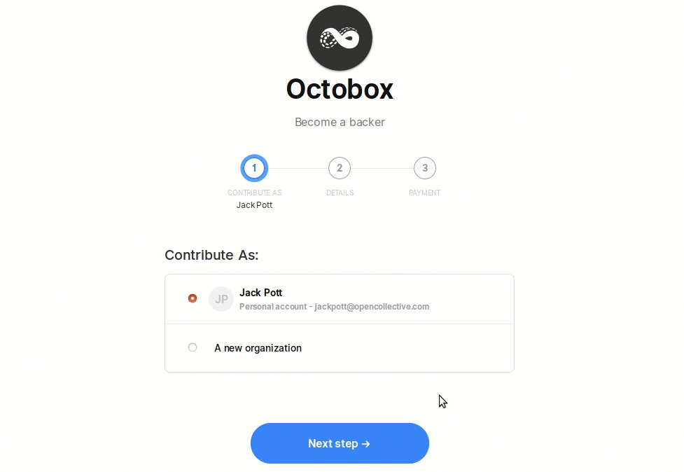

# Payments

## Financial contribution flow

## Payment options

#### Contribute as...

Select who you'd like to pay as—yourself as an individual, or an [Organization](organizations/) or [Collective](../collectives/collectives.md) you manage.

You can also contribute anonymously by making an incognito contribution. If you chose to contribute as "incognito", your financial contribution will show up publicly as an incognito donation and it won't link to your public profile. However, in the effort of being transparent and compliant with KYC regulations (Know Your Customer), the fiscal host and the administrators of the collective can export a list of all the financial contributors with their personal information.

#### Pay with...

1. Credit card - enter the details or use a saved card
2. [Gift card](organizations/gift-cards.md) - select the gift card you want to pay with
3. Collective - contribute [using the balance of one of your Collectives](collectives/collective-to-collective-donations.md) \(if it's in the same host as the one you're donating to\)
4. [Organization](organizations/) - contribute using the balance saved to your Organization

## Subscriptions

### Why do you charge recurring monthly subscriptions on 1st of every month?

It helps our collectives manage their monthly budget. Instead of getting donations randomly throughout the month, they can start with a minimum budget for that month. Any new donations improve the budget.

We're working on a way to charge a single payment spread out across monthly contributions, to reduce payment processor transaction fees.

## Payment changes

To view your current payment methods, go to your profile \(under 'my account'\) and click 'edit profile', then 'payment methods'.

### Save a new credit card for future transactions

Go to manage payment methods in your profile settings and select "add another payment option". If you add a new card, you will have it as an option to make future contributions.

_**Note:** Adding a new card does not change the card for existing recurring contributions._

### Cancel a Subscription

If you have set up a repeating payment to a Collective, such as a monthly contribution, and you want to cancel it, here's how. Under your user menu, go to Subscriptions. Find the one you want to cancel and click the little three dot menu. Select 'cancel'.

### Change the amount or payment method for an existing subscription

Unfortunately we don't have an easy way to do this. You'll need to cancel the existing subscription and set up a new one.

Click "subscriptions" in your user menu and find the subscription. Click the three dot menu next to it and cancel the subscription. Then go back to the Collective and set up a new contribution.

