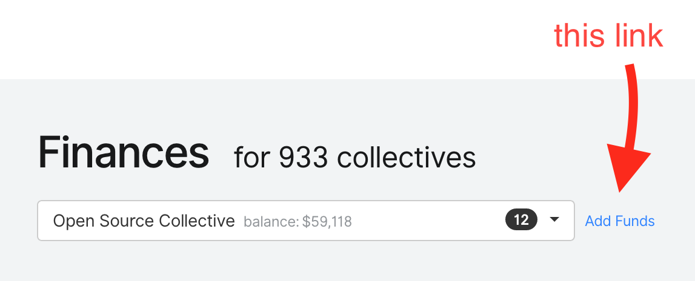

# Add Funds Manually

You can manually add funds to a Collective directly. This is useful when you receive a donation for a Collective outside the Open Collective system \(like a bank transfer\) and want to apply it to a Collective's budget.

Log in and go to your [host dashboard](https://github.com/opencollective/documentation/tree/7991781321e21c71705dddaf37775eeb78dbe972/fiscal-hosts/host-dashboard.md). Click the drop-down menu and select the Collective. Then click 'add funds'.

Put in the details of the funds to add. If you want to create a new source of funds, select 'other' and fill out the info for the new source.

Click the blue "Add Funds" button to save.

