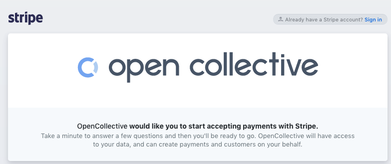

# Create a Fiscal Host

## Starting from scratch

**Go to** [**https://opencollective.com/create**](https://opencollective.com/create)

**Follow the steps to sign in to or create an Open Collective account**  
This is the account for the individual who is the host admin. Normally it's associated with a human name. It will manage your host, which normally has an organization name.

**Create a Collective**  
This can be the Collective for your host's budget \(to receive host fees if you charge them and be transparent\), or for the main project you will be hosting.

**Select "use your own host"**

* **Type of host entity:** Select individual if you will be using your personal accounts, or select organization if you'll be representing a company or incorporated entity. 
* **Select an organization:** Choose "create organization" and enter the details.

**Connect your Stripe account**  
Click the "connect Stripe" button. Create a Stripe account, or log into your existing account by clicking "sign in" in the upper right corner.

**Your host will now be active.**

## If you already have a Collective

Go to your Collective's page, click on the gear next to your logo, head to the Fiscal Host and select **Use your own host**. Follow the steps from there to create your host and connect your Stripe account.

## If you already have an Organization

Follow the same steps as above, except instead of selecting "create organization", select the existing Organization you'd like to use from the drop down menu.

[**Next: customize your Fiscal Host and set the Fiscal Host fee.**](fiscal-host-settings.md)

