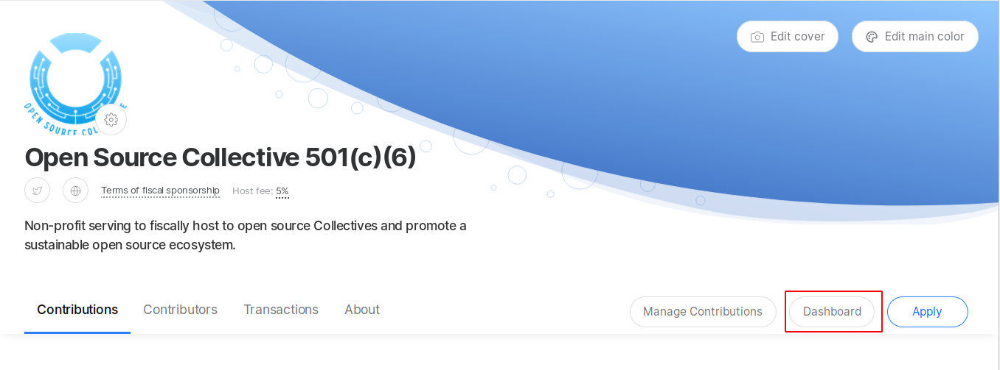
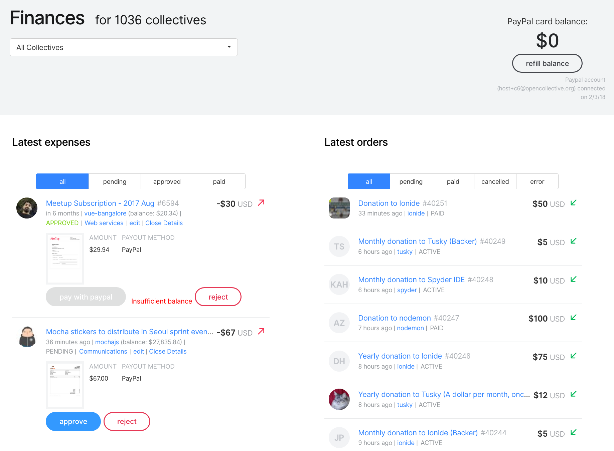

# Fiscal Host Dashboard

**The Fiscal Host Dashboard is your one-stop-shop for seeing all the information and completing your actions as host admin.**

## **FAQ**

### How do  I get to the Host Dashboard?

Click the button on your host page, while logged in as host admin.

### What can I do on the host dashboard?

Here's what it looks like:

#### See your Collectives

Use the dropdown menu to see a list of all the Collectives in the host. Select one to see only info pertaining to that Collective, or use the All Collectives view.

#### Connect PayPal & refill balance

PayPal allows you to pre-approve $2,000 at a time to be paid through the API. This is a security feature. This means after you've paid out $2,000 in expenses, you need to refill the balance. If you try to pay an expense and get an error about the PayPal balance, it's time to refill.

When you click "refill balance" you will be prompted to log in to PayPal, and afterward you'll be taken back to your dashboard.

You can see the connected PayPal account in the top right. This is the account expenses will be paid out of.

If you manage multiple PayPal accounts, make sure it's the right one! If it's not correct, open PayPal in another tab and manually log out, then click "refill balance" and use credentials for the right account.

#### Latest Orders

Shows all incoming funds. You can filter by pending, paid, cancelled, and error.

#### Latest Expenses

Shows submitted expenses.

* **Pending:** expense has been submitted but not yet approved by the Collective's core contributors
* **Approved:** Core Contributor has confirmed this expense is good to pay out
* **Paid:** past expenses already complete

#### Insufficient Balance

There are not enough funds in the Collective to pay this expense. Many Collectives submit expenses in anticipation of future funding.

#### Pay with PayPal

Green button showing that an expense has been approved and there are sufficient funds. If you click this button, the expense will automatically be paid from the connected PayPal account.

#### Mark as Paid

Green button for manual payments. After paying via another method \(bank transfer, etc\), click this to deduct the amount for the Collective's budget in the system.

#### Edit

Host admins have permission to edit expenses at any time. For example, someone wasn't able to attach their receipt and emailed it instead, and you are adding it for them.

**Note:** If you edit an expense, it much be re-approved.

#### Open Expense

If you click the title of an individual expense, you will go to that expense's page. There, you can see all details and read or add [comments](../expenses-and-getting-paid/expense-comments.md).

### Payment Error Troubleshooting

Payment errors will show in red next to the expense if they come up.

Common reasons for a payment to fail after clicking the "Pay with PayPal" button:

* Need to refill the pre-approval balance
  * Click the 'refill balance' button
* Insufficient funds to cover fees
  * If a user submits an expense for 100% of the Collective's balance, there won't be enough to cover processing fees
  * Edit the expense total down to leave enough for the fees and inform the user by leaving a comment
* User's PayPal account is restricted
  * Ask the user to log into PayPal and resolve the issue on their side

