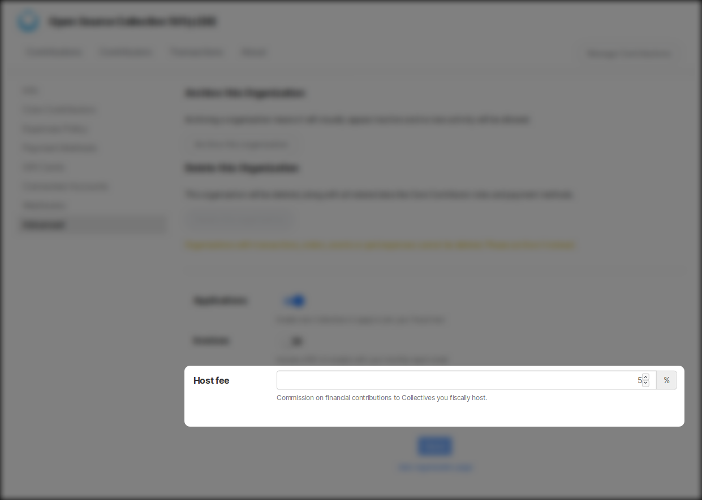
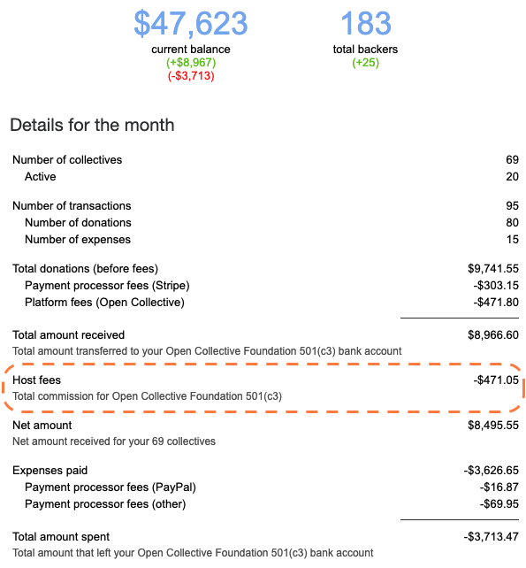

# Host Fees

You have the option to charge a fee to Collectives who use your services as fiscal host.

## Setting the host fee

Go to your Fiscal Host page, click on the gear icon next to your logo and head to **Advanced**.

Set your host fee to 0% if you do not want to charge a fee to your Collectives. This is the commission charges on donations made to Collectives in your host through the platform. Don't forget to save your changes!

## Fees for manual transactions

When you [add funds manually](add-funds-manually.md), you have the option to charge a custom host fee. You may wish to vary the fee depending on the circumstance, such as an agreement to not charge fees for a certain grant, or an extra charge for manual bank processes.

## Accounting for Host fees

Host admins will receive a monthly host report, including an accounting of host fees.

Many hosts opt to add host fees to a Collective, in order to account for income and expenses transparently. To do so, [create a Collective](../collectives/create-collective.md) under your host, and [manually add](add-funds-manually.md) the fees to it each month.

