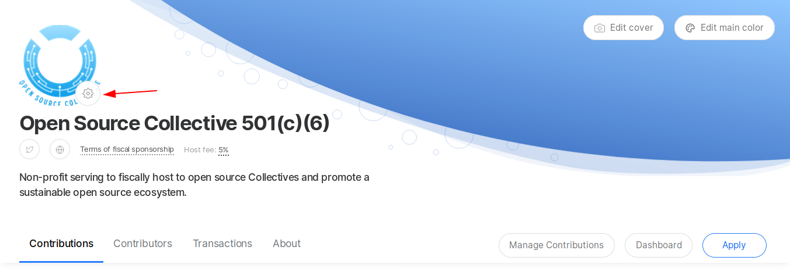
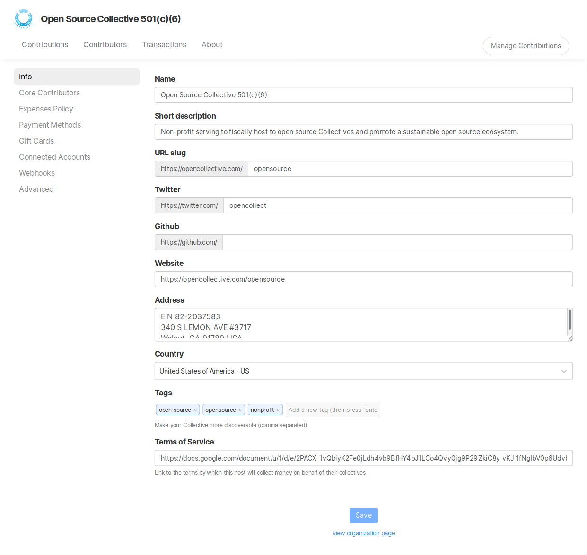
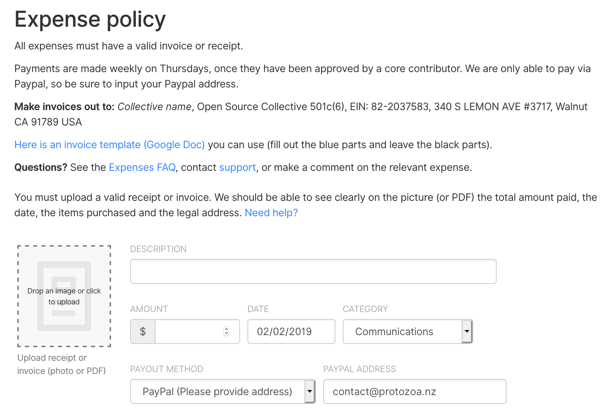

# Fiscal Host Settings

## How to set up and customize your Fiscal Host

Go to your Fiscal Host page and click on the gear next to your logo to reveal the different settings and options for your Fiscal Host.

### Info

Your Fiscal Host organization's name, description, and links.

Under long description, we advise you to enter detailed information about what kind of Collectives you host, and if you're open to applications from new Collectives. What are your requirements, such as geographical location, nonprofit status, or mission area.

You can also link to your official terms of service.

### Images

This is where you can update your logo and banner images.

### Members

Add or update the people who have access to admin your host organization, pay expenses, approve new Collectives \(core contributors\).

### Expenses

This is a very important section, where you can input your expense policy. This information shows up at the top of the screen when people are submitting new expenses to Collectives you host.

We recommend including:

* What documentation is required for expenses to be paid \(eg, receipts\)
* Your payment schedule \(how often you process expenses\)
* Whether you are willing to make manual payments, or Paypal only
* Address and legal entity name for invoices to bill to
* An invoice template \([example](https://docs.google.com/document/d/1ROQA11PaYjGtcie-1Ut8cFV5LCISKipSu8sgsY5U7vw/copy)\)
* Information on where to go for help with expenses

_**Note:**_ [_Collectives can also have an expense policy_](../collectives/expense-policy.md)_, which appears alongside the host policy. This is often focused on what kinds of activities the Collective will approve expenses for._

### Payment Methods

You can add a credit card here if you want to make contributions to Collectives as your organization. You can also specify a limit. This is often used by companies who have multiple people spending their contribution budget.

### Advanced

In the advanced section you can:

* Change the URL of your host page
* Adjust PDF settings
* Change host fee
* Turn off or on applications from Collectives

