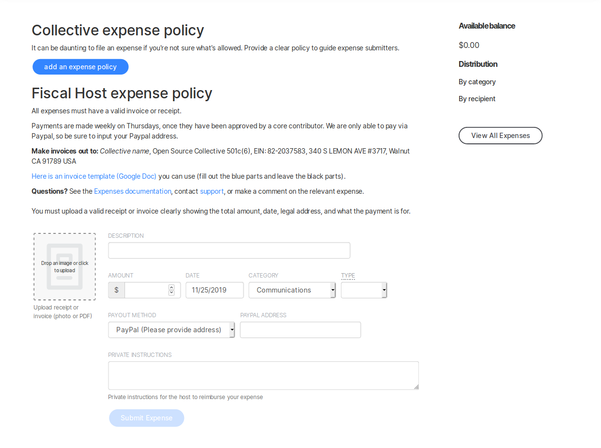
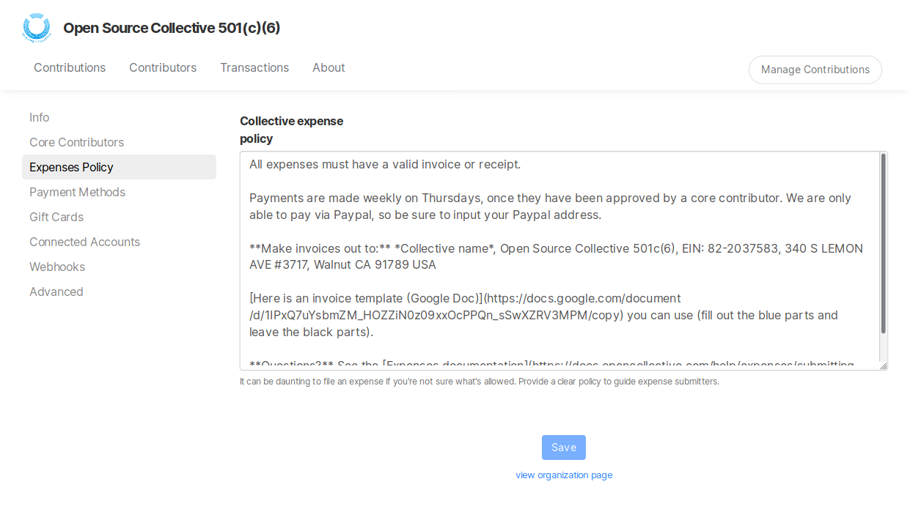

# Invoices

## Where should expense submitters address invoices?

For invoices directly submitted by a vendor or contributor for payment from a Collective's balance, what should the billing address be? It depends on the Fiscal Host.

We've seen two main ways that Fiscal Hosts define their relationship with Collectives: as a project of the Fiscal Host or as an independent unincorporated partnership. The details depend on the legal situation of the country where the Fiscal Host is located and the specifics of how their legal entity is set up.

## Collectives as projects of the Fiscal Host

In this case, the Fiscal Host is liable for the activities of the Collective, just as companies are responsible for projects or departments within them. Invoices should be addressed to the Collective with the address of the Fiscal Host.

E.g.:

Babel  
Open Source Collective 501\(c\)\(6\)  
340 S. Lemon Ave. \#3717  
Walnut, CA 91789 USA

This is the most common setup. It offers all the benefits of having a shared legal entity. However, it's best used by hosts that have a limited scope \(either by topic or by region\) and that have strong trust and policy agreements with their Collectives.

## Collectives as independent unincorporated partnerships

In this case, liability is held by the Core Contributors of the Collective and the Fiscal Host is just holding money on their behalf. Invoices should be addressed to one of the Core Contributors of the Collective and be under the name of the Collective.

E.g.:

XR Belgium  
Xavier Damman  
Personal address  
1000 Brussels

Host should check with local authorities to see if this is something you can do within the bounds of “Fiscal Sponsorship” regulations in your country. It's a good setup for when Hosts don't want to or can't assume legal liability for the actions of Collectives. In Europe, the Collective may need to register for their own VAT number if they have regular commercial activities.

## Communicating the invoicing address

The Fiscal Host Expense Policy is shown on the Submit Expense page of each Collective you host. To define it, go to the settings of your Fiscal Host profile and edit the **Expense Policy** section. It can also be useful to link to an invoice template.

