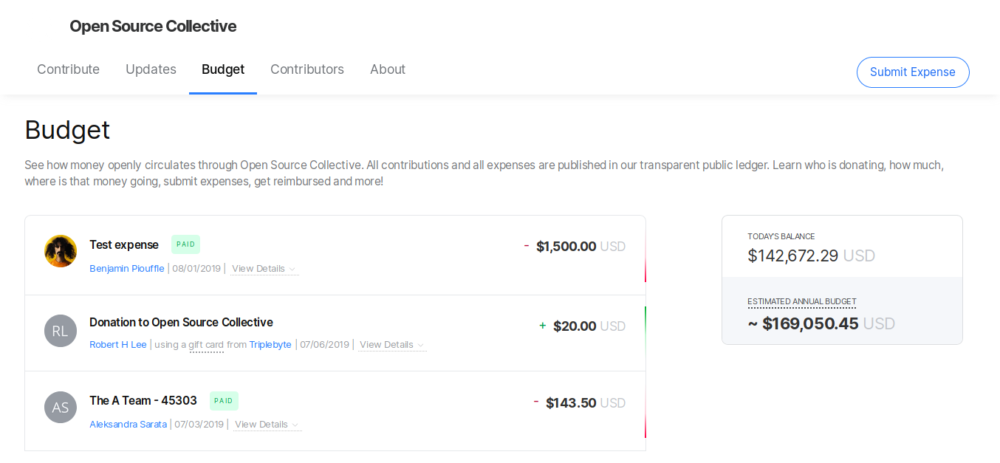
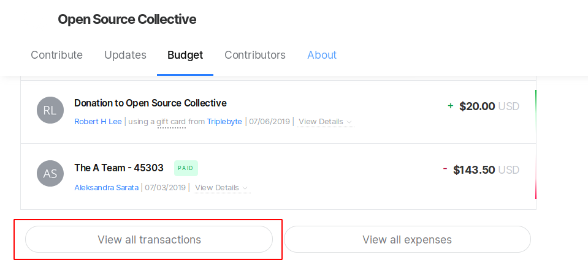
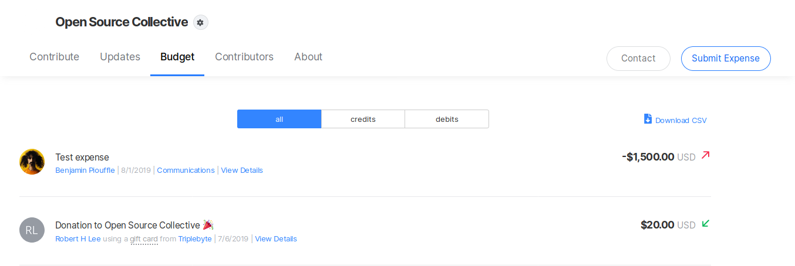
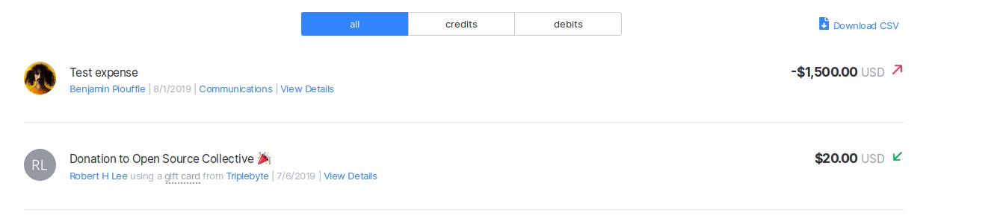
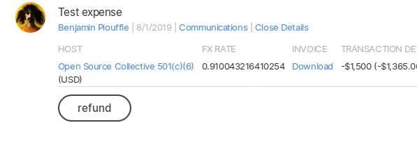

# Refunds


Refunds are processed by Fiscal Host administrators. If you are not the admin, contact your fiscal host \(or Open Collective support if your host is managed by Open Collective\).


### **To refund a donation as a Fiscal Host admin:**

Go to the Collective page and head to the **Budget** section.

Click on **View all transactions**.

Find the transaction you want to refund on the list.

Click on **View details**. You will find a **refund** button right next to the transaction details.

Click on it and confirm the operation.

