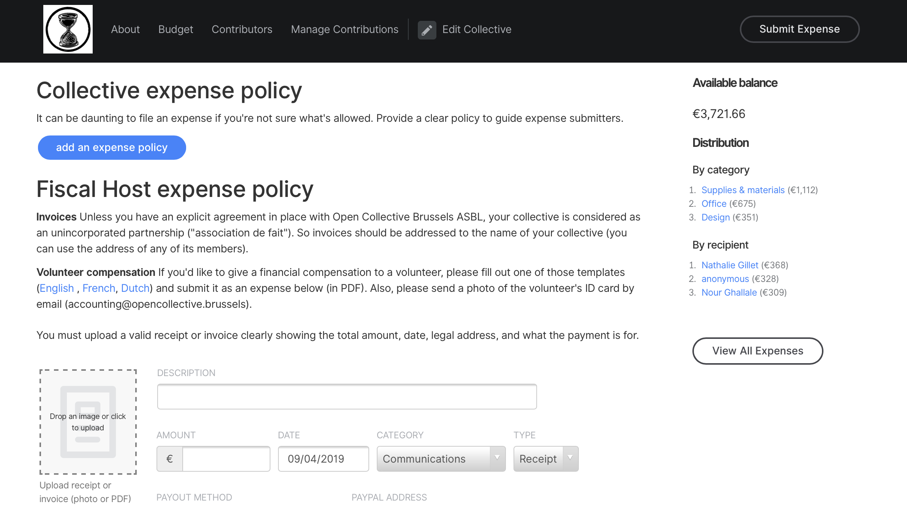
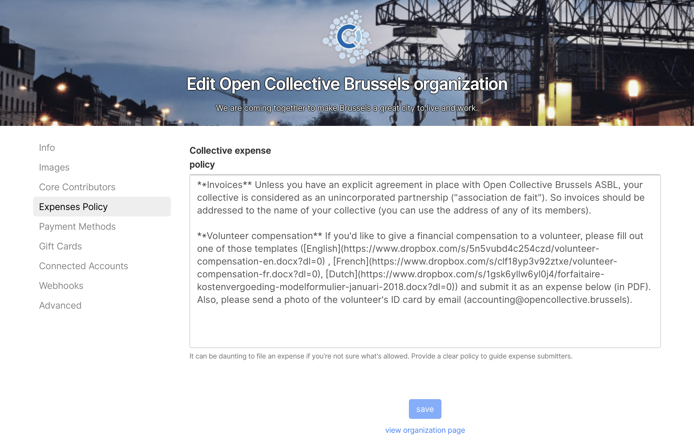

# Invoices

A question that often comes up is where should a collective address an invoice? When it’s a receipt, it’s easy. There is no billing address. A member of the collective pays it, takes a picture of the receipt and submits it to the collective. She/he gets reimbursed. Simple.

Things become more complicated when it’s an invoice directly submitted by a vendor \(or by one of the contributors for their time as a contractor\). What should be the billing address?

It depends on your Fiscal Host.

There are basically two different ways to define the relationship between a Fiscal Host and a Collective. Either the Collective is considered as a project of the Fiscal Host, or the Collective is considered as an independent unincorporated partnership.

### Collectives as projects of the Fiscal Host

In this case, the Fiscal Host is liable for the activities of the Collective. Invoices should be addressed to the Collective with the address of the Fiscal Host, e.g.

Babel  
Open Source Collective 501c6  
340 S. Lemon Ave. \#3717   
Walnut, CA 91789 USA

While this is the recommended setup because it really offers all the benefits of having a \(shared\) legal entity to the collectives, this should be limited to hosts that have a limited scope \(either by topic or by region\) and that can trust the Collectives that they are hosting.

### Collectives as independent unincorporated partnerships

In this case, the liability is shared by all the members of the collective and the Fiscal Host is just holding the money on their behalf. Invoices should be addressed to one of the \(core\) contributors of the collective under the name of the Collective, e.g.

XR Belgium  
Xavier Damman  
Personal address  
1000 Brussels

This is the safest setup for Fiscal Hosts but you should check with your local authorities if this is something that you can do while staying within the boundaries of  “Fiscal Sponsorship” regulations. This is a great setup for Collectives for which you might not want to endorse any legal liability for their actions. Note that in that case, in Europe, the Collective may need to register for their own VAT number if they happen to have regular commercial activities to bring money into their Collective.

### Communicating the billing address

Once you have defined the relationship that you will have with your Collectives, you should communicate what billing address they should use when submitting an expense. The best place to do that is within the Fiscal Host Expense Policy that is shown on the Submit Expense page of each Collective that you are hosting. Just go to the settings of your Fiscal Host profile and edit the appropriate section.

