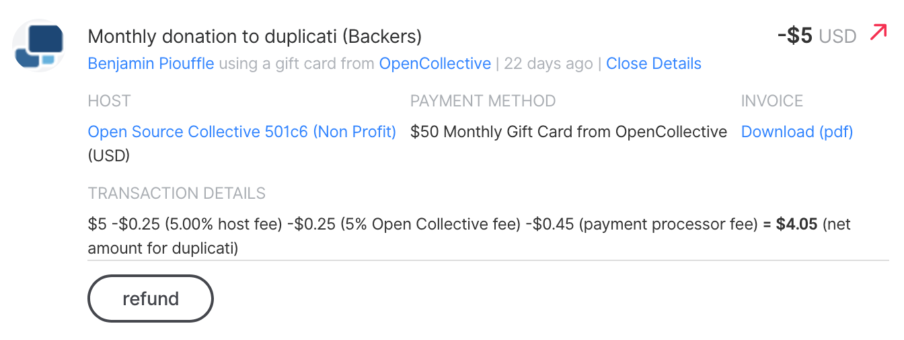

# Refunds

To refund a donation to one of your Collectives:

1. Go to the Collective page and find the budget section
2. Click "all transactions"
3. Find the one you want to refund on the list
4. Click 'View details'
5. Then you'll see the 'refund' button
6. Click it and confirm

