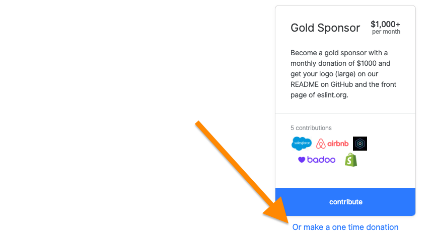

# Maintainerati Berlin 2019

**Open Collective is partnering with** [**Maintainerati**](https://maintainerati.org)**!**

**We're distributing $25 Gift Cards to each participant to contribute to the open source project of their choice.**

## Which Collectives can I donate to?

This Gift Card is issued in partnership with the [Open Source Collective 501\(c\)\(6\)](https://opencollective.com/opensourcecollective) \(nonprofit\) and is limited to Collectives in this [fiscal host](https://github.com/opencollective/documentation/tree/7991781321e21c71705dddaf37775eeb78dbe972/internal/hosts/README.md)—representing the vast majority of open source projects on the platform.

Unfortunately you're not able to use these gift cards to give to Collectives in other fiscal hosts.

To see all the Collectives you can choose from, see the listing on the [Open Source Collective's host page](https://opencollective.com/opensourcecollective), or search for a project and look for the fiscal host underneath the title.

## Will my gift card expire?

Yes. The expiry is 1 month after the event \(24 June 2019\). Be sure to use your gift card balance by then!

## Should I make a one-off or recurring contribution?

We don't recommend using the gift card balance for recurring contributions, because it will expire after one month, at which point it will fail as a payment source. Please use the "make a one time donation" option available below the tier options on every Collective page.

## I made a mistake or I still have questions....

Please contact [support@opencollective.com](mailto:support@opencollective.com).

