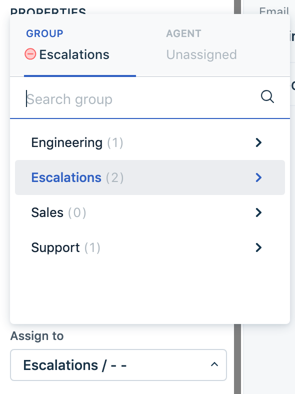
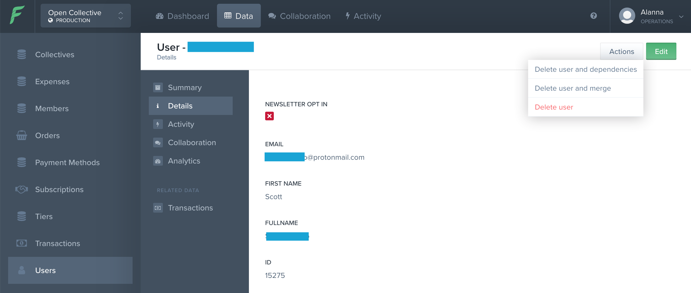

# Support

## Support Ticket System

Open Collective uses [FreshDesk](https://opencollective.freshdesk.com) to track support requests. All messages sent to support@opencollective.com automatically create a ticket in the system.

Alanna is looking after general support. She triages all incoming tickets and resolves the ones she can. Other team member are also welcome to pick up tickets. The FreshDesk system makes it clear if a response has already been sent.

### Statuses

Please keep the status of tickets you've worked on up to date.

* Open - new ticket or not yet answered
* Pending - waiting for user reply
* Resolved - support request answered
* Closed - user has confirmed resolution

### Tags

We use tags to track different categories of tickets, to help us understand what problems are most common and prioritise updates to the platform to fix them.

Please add tags to tickets you work on to help our data gathering. You can see a list of all tags and how many tickets each has associated in the [tags section of the admin panel](https://opencollective.freshdesk.com/a/admin/tags).

### Reassigning Tickets

If a problem doesn't have a known solution or is outside the scope of general support, the ticket can be assigned the ticket to another team member with specialist knowledge.

* Engineering: for technical bugs or unknown error messages
* Xavier: OC-EU related issues
* Pia: Database changes not possible in Forest, and all other escalated issues

To reassign a ticket, use the "assign to" property.

## Common Issues

#### Cancel Subscription

Users have trouble finding the cancel subscription option in our interface.

> _To cancel a subscription, go to your user menu and click 'subscriptions' in the 'my account' section. Find the one you want to cancel and click the little three dot menu. Select 'cancel'._

We are not able to cancel subscriptions on users' behalf; they need to do it themselves.

#### Deletions

We don't have a way for users to delete their Collectives or their accounts yet, so they send us requests to do it for them. To do this, we use Forest to edit the database.

To cancel a user account, search for their email address is the "users" section, click "actions" and select "delete user and dependencies". Confirm the action by ticking the box and clicking the button.

The process is similar for deleting a Collective: search for it under "Collectives", click "actions", and select "delete Collective and dependencies".

If you encounter an error when trying to delete, it means there are undeletable records associated with the account. In that case, assign the ticket to escalated support.

### Payment Errors

Users will sometimes contact us when their credit card fails. This is almost always an issue with the card \(expired, low balance, etc\). We can see the failed attempts through Stripe, so if a user insists their card works, assign the ticket to escalated support and they'll have a look.

### Payment Methods

Can you pay via another method besides PayPal?

* Usually no, except as a special exception
* If the user's country doesn't have PayPal, we can use TransferWise or Payoneer
* We can do direct bank transfers for large, infrequent amounts

Can you receive funds other than by credit card?

* Yes, by special agreement, which we do when we can if it will help our Collectives
* Generally only large, infrequent amounts

I wish you had \[insert payment method\] available.

* We're working on it! 
* Point to Github issue, or raise a new one

### Change Email

There's no way for users to change their own emails, so we do it for them. Find them in Forest and click "edit", then update the email field.

### Feature Requests

Ask them to raise a Github Issue, or link to one if it already exists.

### Refunds

Find the transaction in the relevant Collective and click the "refund" button.

### Collective Verification

If a new Collective applies to one of our hosts, we need to make sure they meet the requirements. Check out the project and refer to the Host's description to assess. If they don't meet the requirements, advise them to select another Host or start their own Host.

