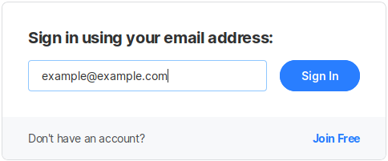
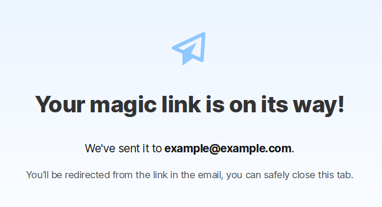

# Log-in System

Open Collective works with a **no-password system,** because our users appreciate not having to remember another password, especially when on mobile.

### **How it works**

You type in your email and the system instantly knows if you're an existing user or a new user.

If you already have an account, we send you an email with a unique link that logs you into Open Collective. You will stay logged in for 30 days on that device.

If you're a new user, you'll be prompted to create an account.

